`did:webplus` Method Specification
==================

**Specification Status:** Draft v0.3

**Latest Draft:**
  [https://ledgerdomain.github.io/did-webplus-spec/](https://ledgerdomain.github.io/did-webplus-spec/)

Authors:
- Victor Dods ([LedgerDomain](https://ledgerdomain.com/))
- Alex Colgan ([LedgerDomain](https://ledgerdomain.com/))

Editors:
~ [Juan Caballero](https://github.com/bumblefudge/)

Participate:
~ [GitHub repo](https://github.com/LedgerDomain/did-webplus-spec)
~ [File a bug](https://github.com/LedgerDomain/did-webplus-spec/issues)
~ [Commit history](https://github.com/LedgerDomain/did-webplus-spec/commits/main)

------------------------------------

## Abstract

`did:webplus` extends `did:web` to provide cryptographic verifiability of a DID's entire history of [[ref: DID Document]]s, making it particularly suitable for heavily regulated ecosystems like the pharmaceutical supply chain. Key features include:

* Cryptographic verification of DID Document history, enabling [[ref: Verifying Parties]] to independently verify DID Documents without trusting the [[ref: Verifiable Data Registry]]
* Multiple architectural levels (basic, intermediate, advanced) to support different use cases and security requirements
* Support for both "Full" DID resolvers (that handle fetching, verifying, and archival) and "Thin" DID resolvers (that work with [[ref: Verifiable Data Gateway]]s)
* Optional advanced features like VDG clusters and CDN integration for hyper-scaled deployments
* Backward compatibility with `did:web` while adding stronger guarantees of immutability and auditability

The method is designed to be fit-for-purpose for regulated environments while remaining accessible for general use cases that require stronger verifiability guarantees than `did:web` provides.

### Intended Audience for This Document

This document is intended for:
-   Developers who want to use, implement, or integrate `did:webplus` in software systems.
-   Digital identity ecosystem stakeholders who wish to understand the purposes and capabilities of `did:webplus`.
-   Policy/compliance reviewers in regulated deployments.

It is assumed that the reader is familiar with the concepts in the [DID spec](https://www.w3.org/TR/did-1.0/).  A familiarity with the [`did:web`](https://w3c-ccg.github.io/did-method-web/) method is useful to understand the context and motivation for `did:webplus`.

### Key Word Usage

The key words "MUST", "MUST NOT", "REQUIRED", "SHALL", "SHALL NOT", "SHOULD", "SHOULD NOT", "RECOMMENDED",  "MAY", and "OPTIONAL" in this document are to be interpreted as described in [RFC 2119](https://www.rfc-editor.org/rfc/rfc2119).

## Implementations

Rust implementation, licensed under the [MIT License](https://github.com/LedgerDomain/did-webplus/blob/main/LICENSE) by LedgerDomain:
-   [`did:webplus` Verifiable Data Registry (VDR) service (reference implementation)](https://github.com/LedgerDomain/did-webplus/tree/main/did-webplus/vdr)
-   [`did:webplus` Verifiable Data Gateway (VDG) service (reference implementation)](https://github.com/LedgerDomain/did-webplus/tree/main/did-webplus/vdg)
-   [`did-webplus` CLI tool (reference implementation for DID Controller, DID Resolver, and Verifying Party operations)](https://github.com/LedgerDomain/did-webplus/tree/main/did-webplus/cli)

More information, as well as all source code, is available at <https://github.com/LedgerDomain/did-webplus>.

## Overview

The `did:web` method makes straightforward use of familiar tools across a wide range of use cases. However, heavily regulated ecosystems such as the pharmaceutical supply chain demand additional guarantees of immutability and auditability, including seamless key rotation and a key usage history. `did:webplus` is a proposed fit-for-purpose DID method for use within the pharma supply chain credentialing community, with an eye towards releasing it with the intention of broader release for those communities that are similarly situated.

### Terminology

Generally, refer to the [DID core specification](https://www.w3.org/TR/did-1.0/) for terminology general to DIDs.  In addition to `did:webplus`-specific terms, some existing terms will be described here explicitly to illustrate their importance to `did:webplus`.

[[def: DID Controller]]

~ (Controller): A [DID Controller](#did-controller) is an entity capable of making valid changes to a [[ref: DID Document]], represented by a public key; by default, a DID's only controller is its subject, but update capabilities can be delegated to devices, "restore keys", etc. Concretely, these keys are listed in the `capabilityInvocation` verification relationship in the DID Document. For a DID update to be valid, the new DID Document must be valid [Self-Hashed Signed Data](#self-hashed-signed-data).

[[def: DID Document]]

~ A `did:webplus` [DID Document](#did-document-data-model) conforms to that of the [DID core specification](https://www.w3.org/TR/did-1.0/#dfn-did-documents), and has a few additional `did:webplus`-specific fields and constraints, defined in [this section](#did-document).

[[def: DID Resolver]]

~ (Resolver): A [DID resolver](#did-resolver) translates a DID URL into a [[ref: DID Document]] through a "resolution" process. As with `did:web`, this involves translating the DID into a specific URL (or set of URLs) that can be used to fetch the current or any historical DID Document(s).  Because a `did:webplus` DID corresponds to a sequence of DID Documents in its [[ref: Microledger]], the resolver must handle both current and historical resolution.

[[def: Full DID Resolver]]

~ (Full Resolver): A [Full DID Resolver](#full-did-resolver) is a DID resolver that fetches, verifies, and stores all [[ref: DID Document]]s in a [[ref: Microledger]] for a given DID.

[[def: Thin DID Resolver]]

~ (Thin Resolver): A [Thin DID Resolver](#thin-did-resolver) is a DID resolver that uses a [[ref: Verifiable Data Gateway]] to fetch and verify [[ref: DID Document]]s for a given DID.

[[def: Microledger]]

~ A [Microledger](#did-microledger) is the cryptographically verifiable history of a DID, represented as an ordered sequence of [[ref: DID Document]]s. Each DID Document in the Microledger is [Self-Hashed Signed Data](#self-hashed-signed-data), with each [[ref: Non-Root DID Document]] linking to its predecessor via the predecessor's `selfHash` field.

[[def: Non-Root DID Document]]

~ (Non-Root Document): A [Non-Root DID Document](#non-root-did-documents) is any [[ref: DID Document]] in the [[ref: Microledger]] after the [[ref: Root DID Document]]. It has specific constraints that ensure that each Non-Root DID Document is cryptographically committed to its predecessor, maintaining the integrity and authorization chain of the entire [[ref: Microledger]].

[[def: Resolution URL for a DID, Resolution URL]]

~ (Resolution URL): A [Resolution URL for a DID](#did-to-url-mapping) is the URL used to create, update, or fetch the [[ref: Microledger]] for that DID.

[[def: Root DID Document]]

~ (Root Document): A [Root DID Document](#root-did-document) is the first and foundational [[ref: DID Document]] in a DID's [[ref: Microledger]].  The Root DID Document's unique role in binding the DID to its initial state makes it computationally infeasible to alter, providing a strong foundation for the DID's entire history.

[[def: Verifiable Data Gateway, VDG]]

~ (VDG): A [Verifiable Data Gateway](#verifiable-data-gateway) (VDG) is a large-scale web service that provides several crucial features for `did:webplus`: witnessing, archival, resolution services, as well as a scope of agreement for [[ref: DID Document]] validity.  It also makes possible the use of "Thin" DID resolvers that rely on the VDG to fetch and verify on their behalf.  The Verifiable Data Gateway is a critical component for regulated ecosystems, providing the capabilities needed for robust long-term non-repudiation and auditability.

[[def: Verifiable Data Registry, VDR]]

~ (VDR): A [Verifiable Data Registry](#verifiable-data-registry) (VDR) is a web service that serves as the origin for the [[ref: DID Document]]s for DIDs associated with its domain.  A VDR is the authoritative, primary source for DID resolution for DIDs matching its domain, and can range in scale from a personal website to a large-scale web service.  It can be configured to notify [[ref: Verifiable Data Gateway]]s of DID updates to reduce the latency of resolution for clients that rely on the VDG.

[[def: Verifying Party, Verifying Parties]]

~ (Verifier): A [Verifying Party](#verifying-party) can verify a digitally signed artifact by resolving the DID of the signer to obtain and use the appropriate public key for signature verification.  A Verifying Party will use a [[ref: DID Resolver]] to resolve the DID. They may use a Full DID Resolver or a Thin DID Resolver, depending on their needs (see [Architectural Variations](#didwebplus-architecture) appendix for details).

## `did:webplus` Specification

### Architectural Components

-   [DID Controller](#did-controller)
-   [Verifiable Data Registry](#verifiable-data-registry)
-   [DID Resolver](#did-resolver)
-   [Verifying Party](#verifying-party)
-   [Verifiable Data Gateway](#verifiable-data-gateway) (though technically optional, it is required for the full feature set of `did:webplus`)
-   [DID Document Store](#did-document-store) (this is a subcomponent of the other components)

Please see the following diagrams for a visual representation of the relationships between the architectural components of `did:webplus`:
-   [Most Basic `did:webplus` Architecture](#most-basic-didwebplus-architecture)
-   [Intermediate `did:webplus` Architecture](#intermediate-didwebplus-architecture)
-   [Advanced `did:webplus` Architecture](#advanced-didwebplus-architecture)

### Method-Specific Identifier

A `did:webplus` DID takes the following form, with `[]` brackets indicating optional components, and `<>` brackets indicating required, named components:

    did:webplus:<host>[%3A<port>][:<colon-delimited-path>]:<root-self-hash>

The port number and path components are optional.  The `<root-self-hash>` component must be equal to the `selfHash` field of the [[ref: Root DID Document]], thereby cryptographically committing the DID to the contents of its Root DID Document.  Note that because the `selfHash` field is the value from the Root DID Document (NOT the latest DID document), the DID itself never changes, even upon update.

Examples:

    did:webplus:example.com:uHiBKHZUE3HHlYcyVIF-vPm0Xg71vqJla2L1OGXHMSK4NEA
    did:webplus:example.com:p1:uHiBKHZUE3HHlYcyVIF-vPm0Xg71vqJla2L1OGXHMSK4NEA
    did:webplus:example.com:p1:p2:uHiBKHZUE3HHlYcyVIF-vPm0Xg71vqJla2L1OGXHMSK4NEA
    did:webplus:example.com%3A3000:uHiBKHZUE3HHlYcyVIF-vPm0Xg71vqJla2L1OGXHMSK4NEA
    did:webplus:example.com%3A3000:a:very:long:path:uHiBKHZUE3HHlYcyVIF-vPm0Xg71vqJla2L1OGXHMSK4NEA

### DID Resolution Mechanics and DID Query Parameters

Resolving a DID without query parameters should return that DID's latest DID document.  Resolving a DID with query parameters should return the specified DID document.  As in `did:web`, this involves translating the DID into a specific URL that is used to HTTP GET the DID's microledger.

In order to determine the latest DID document, the resolver MUST query the VDR hosting the DID's microledger, because it is the authority on which DID document is the latest.

#### DID to URL Mapping

The DID-to-resolution-URL translation rules for the latest DID document are nearly identical to those for `did:web`:
1. Drop `did:webplus:` prefix
2. Replace all instances of `:` with `/`
3. Percent-decode (this accounts for the optional colon-prefixed port number)
4. Append `/did-documents.jsonl`
5. If the domain is `localhost`, prepend `http://` -- otherwise prepend `https://`

The resulting URL is called the [[ref: Resolution URL]] for the DID.

Examples:

    did:webplus:example.com:uHiBKHZUE3HHlYcyVIF-vPm0Xg71vqJla2L1OGXHMSK4NEA -> https://example.com/uHiBKHZUE3HHlYcyVIF-vPm0Xg71vqJla2L1OGXHMSK4NEA/did-documents.jsonl
    did:webplus:example.com:path-component:uHiBKHZUE3HHlYcyVIF-vPm0Xg71vqJla2L1OGXHMSK4NEA -> https://example.com/path-component/uHiBKHZUE3HHlYcyVIF-vPm0Xg71vqJla2L1OGXHMSK4NEA/did-documents.jsonl
    did:webplus:example.com%3A3000:uHiBKHZUE3HHlYcyVIF-vPm0Xg71vqJla2L1OGXHMSK4NEA -> https://example.com:3000/uHiBKHZUE3HHlYcyVIF-vPm0Xg71vqJla2L1OGXHMSK4NEA/did-documents.jsonl
    did:webplus:example.com%3A3000:path-component:uHiBKHZUE3HHlYcyVIF-vPm0Xg71vqJla2L1OGXHMSK4NEA -> https://example.com:3000/path-component/uHiBKHZUE3HHlYcyVIF-vPm0Xg71vqJla2L1OGXHMSK4NEA/did-documents.jsonl

    did:webplus:localhost:uHiBKHZUE3HHlYcyVIF-vPm0Xg71vqJla2L1OGXHMSK4NEA -> http://localhost/uHiBKHZUE3HHlYcyVIF-vPm0Xg71vqJla2L1OGXHMSK4NEA/did-documents.jsonl
    did:webplus:localhost:path-component:uHiBKHZUE3HHlYcyVIF-vPm0Xg71vqJla2L1OGXHMSK4NEA -> http://localhost/path-component/uHiBKHZUE3HHlYcyVIF-vPm0Xg71vqJla2L1OGXHMSK4NEA/did-documents.jsonl
    did:webplus:localhost%3A3000:uHiBKHZUE3HHlYcyVIF-vPm0Xg71vqJla2L1OGXHMSK4NEA -> http://localhost:3000/uHiBKHZUE3HHlYcyVIF-vPm0Xg71vqJla2L1OGXHMSK4NEA/did-documents.jsonl
    did:webplus:localhost%3A3000:path-component:uHiBKHZUE3HHlYcyVIF-vPm0Xg71vqJla2L1OGXHMSK4NEA -> http://localhost:3000/path-component/uHiBKHZUE3HHlYcyVIF-vPm0Xg71vqJla2L1OGXHMSK4NEA/did-documents.jsonl

Note that in the case where the domain is `localhost`, the HTTP scheme is `http`, not `https`.  This convention has been adopted to ease local testing of DID resolution during development.

### DID Controller

A [DID controller](https://www.w3.org/TR/did-1.0/#dfn-did-controllers) is an entity capable of making valid changes to a DID document.  A DID might have more than one controller (e.g. Alice's laptop and Alice's smartphone, or Bob's smartphone and Charlie's smartphone).  For `did:webplus`, the controllers are defined by the content of the [`updateRules` field](#update-rules) of the DID document, which defines specific rules for possible sets of signatures that are defined to authorize a DID update.

Here are the actions that a DID controller can take:

#### DID Create

A soon-to-be DID controller can create a DID by forming an un-signed, un-self-hashed root DID document that includes the desired components of the DID (VDR domain, port, and path components), verification methods, appropriate update rules, optional proofs, and then [self-hashing](#self-hashed-data) the DID document, and then `HTTP POST`-ing the DID document to the [resolution URL for the DID](#did-to-url-mapping).

The DID document has several [self-hash slots](#self-hash-slots), notably including the suffix of the DID.  This construction is what cryptographically commits the DID to the content of its root DID document.

#### DID Update

A DID controller can update a DID by forming an un-signed, un-self-hashed updated DID document with appropriate relationships to the previous DID document, updated content (including verification methods, update rules, etc.), and then adding proofs over the un-signed, un-self-hashed updated DID document that satisfy the `updateRules` field of the previous DID document, [self-hashing](#self-hashed-data) the DID document, and then `HTTP PUT`-ing the DID document to the [resolution URL for the DID](#did-to-url-mapping).

#### DID Deactivate

DID deactivation is supported by updating the DID document to have `updateRules` field set to `{}`, indicating that updates are disallowed, effectively "tombstoning" the DID.  It is RECOMMENDED that this final DID document (the "tombstone") contain no verification methods, to avoid having verification methods that can't be rotated/revoked.

#### DID Delete -- Explicitly Not Supported

"DID Delete" is not a well-defined operation in general in `did:webplus`, given that copies of any given DID document will be archived by other components, especially the VDG.  A VDR could support deleting a DID's microledger from its own data store, but it doesn't guarantee that the deletion will be propagated to all other components, and in fact, deletion is contrary to the purpose of the VDG.  Thus users of `did:webplus` should expect that DID documents can never be truly deleted.

#### Digitally Sign using Controlled DID

When a DID controller digitally signs an artifact, it uses a private key corresponding to one of its public keys, and includes in the artifact the fully qualified DID resource of the key used to sign.  This establishes:
-   The identity of the signer (the DID controller).
-   The specific key that can be used to verify the artifact.
-   The `selfHash` and `versionId` of the DID document that was current at the time of signing.

An example of a fully qualified DID resource is

    did:webplus:example.com:uHiBKHZUE3HHlYcyVIF-vPm0Xg71vqJla2L1OGXHMSK4NEA?selfHash=uHiDjConlZgv4fMol7F_LNmw73KIXfTzcBG2kOHsWm8WTBg&versionId=1#0

This is "fully qualified" in that it defines the specific DID, specific DID document (by its `selfHash` and `versionId` values), and specific key `0`.

#### Update Rules

The `updateRules` field is a JSON object which is one of the following forms:
-   `{}` -- no update rules are defined, meaning that updates are disallowed.
-   NonRootUpdateRules -- a JSON object of the following form:
    -   `{"key": "<MBPubKey>"}` -- a key, represented as an [MBPubKey](#mbpubkey-values) value, whose signature is defined to satisfy this rule.  It is recommended that base64url-encoding is used, but base58btc-encoding is also supported.  Note that a base58btc-encoded MBPubKey is identical to the DID-method specific identifier for `did:key`.
    -   `{"hashedKey": "<MBHash>"}` -- the hash, represented as an [MBHash](#mbhash-values) value, of the MBPubKey whose signature is defined to satisfy this rule.  It is recommended that base64url-encoding is used.
    -   `{"any":[<NonRootUpdateRules>, ...]}` -- this rule is satisfied if any of the given rules are satisfied.
    -   `{"all":[<NonRootUpdateRules>, ...]}` -- this rule is satisfied if all of the given rules are satisfied.
    -   `{"atLeast":<N>, "of":[<WeightedUpdateRules>, ...]}` -- this rule is satisfied if the sum of the weights of the satisfied rules is at least N.
-   WeightedUpdateRules -- a JSON object which is one of the following forms:
    -   NonRootUpdateRules -- this rule is satisfied if the given NonRootUpdateRules object is satisfied, and it has a weight of 1.
    -   `{"weight":<N>, ...}` -- here, `...` is the content of a NonRootUpdateRules object.  The rule is satisfied if that NonRootUpdateRules object is satisfied, and if so, has the given weight within the `"atLeast"` type rule.

### Verifiable Data Registry

A Verifiable Data Registry (VDR) is a web service that serves the DID documents for DIDs associated with its domain.  This is a concept inherited from `did:web`.  The VDR is the origin for the DID documents for a given DID.  However, a DID's controller is the author of its DID documents.  As mentioned before, there is no verification of DID documents in the `did:web` method, and part of what `did:webplus` adds is a mechanism for cryptographically verifying DID documents.

The scale and scope of a VDR ranges anywhere from a person's self-hosted website hosting one or more DIDs to a hyper-scaled web service hosting millions of DIDs (e.g. on the scale of a large consumer web service).

Here are the operations provided by a VDR:

#### DID Create

From the perspective of the VDR, DID creation is simply a matter of verifying and storing a DID document `HTTP POST`-ed to the appropriate endpoint.  In addition to the generic DID document verification, the VDR MUST validate that the DID's domain, optional port, and path are all consistent with the VDR's service domain, port, and path.

To illustrate the DID creation process as a whole, say that Alice wants to create a DID.  Alice creates the root DID document, signs and self-hashes it, and then `HTTP POST`-s it to the [resolution URL for the DID](#did-to-url-mapping).  Note that the DID itself, which contains the self-hash of the root DID document, is derived during the creation process, and not determined by the VDR, but by Alice before the HTTP POST operation.

The following diagram illustrates the process.

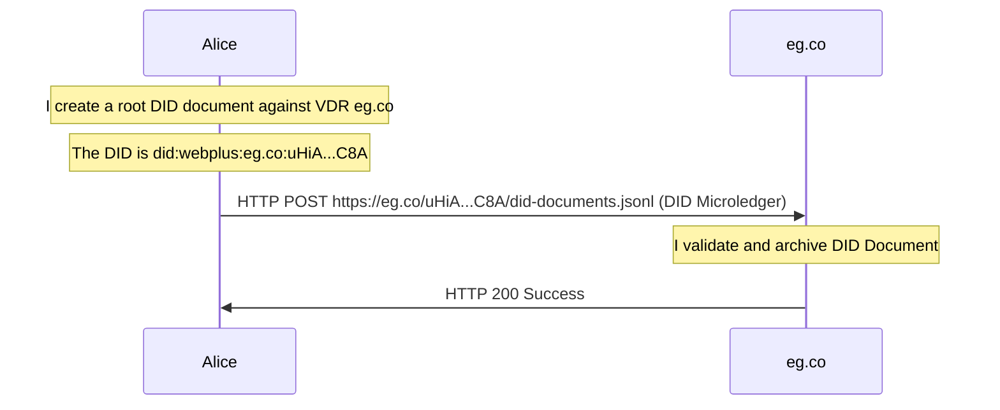

#### DID Resolve

The DID resolution process is intended to be used by a Verifying Party to obtain a specific version of a DID document for a given DID.  The DID document contains the public keys of the DID controller, and is used to verify signatures on artifacts signed by the DID controller.

With respect to DID resolution, the VDR has a simple job -- simply serve the `did-documents.jsonl` file of each DID at the [resolution URL for the DID](#did-to-url-mapping).  `did-documents.jsonl` is simply a newline-delimited concatenation of the ordered sequence of JCS-serialized DID documents.

If the DID is `did:webplus:example.com:uHiBKHZUE3HHlYcyVIF-vPm0Xg71vqJla2L1OGXHMSK4NEA` then the DID resolution URL is `https://example.com/uHiBAgZTMYe29bhacxcReklhgbWzSbVTd5c-jL62nfES-4Q/did-documents.jsonl`.

A DID Resolver is used to fetch the appropriate data, perform the appropriate validation, and return the requested DID document.  Common resolution patterns are:
-   Resolve the latest DID document.  This corresponds to a query of the DID itself (in the above example, `did:webplus:example.com:uHiBKHZUE3HHlYcyVIF-vPm0Xg71vqJla2L1OGXHMSK4NEA`).  In order to do this, the DID Resolver must fetch any new updates from the VDR, and then serve the last DID document in that DID's microledger.  The query
-   Resolve a specific DID document, identified by `selfHash` and/or `versionId` query parameters (using the DID in the above example, `did:webplus:example.com:uHiBKHZUE3HHlYcyVIF-vPm0Xg71vqJla2L1OGXHMSK4NEA?selfHash=uHiC6qUSqrRAoQnfHjurPindtTxx7T7HNqP79FNW9YQVOYA`, or `did:webplus:example.com:uHiBKHZUE3HHlYcyVIF-vPm0Xg71vqJla2L1OGXHMSK4NEA?versionId=3`, or providing both query parameters).  If the requested DID document is already present in the DID Resolver's [DID Document Store](#did-document-store) and is not the latest DID document present in that [DID Document Store](#did-document-store), then it can be returned without contacting the VDR.  Otherwise, updates must be fetched from the VDR in order to retrieve the appropriate DID Document and to be able to produce the [DID Document Metadata](#did-document-metadata) and [DID Resolution Metadata](#did-resolution-metadata).

To illustrate, Bob resolves a DID to obtain the latest version of its DID document.  This is done simply via HTTP GET to the [resolution URL for the DID](#did-to-url-mapping), and is precisely analogous to the process for `did:web`.

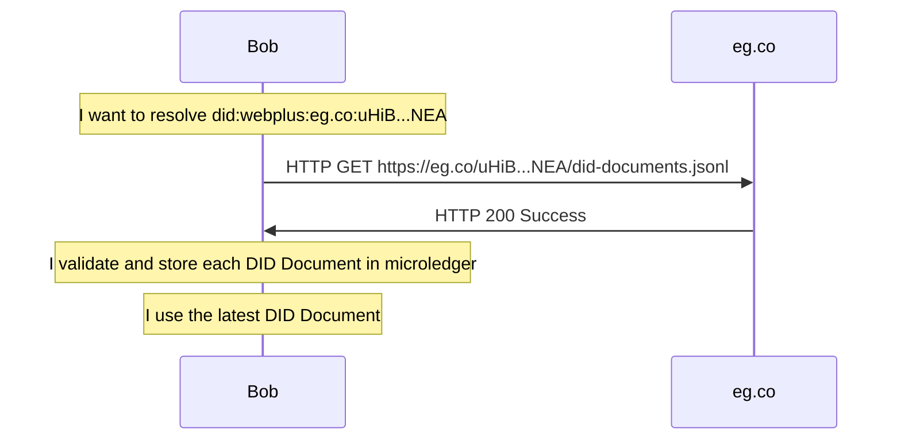

Bob resolves a specific DID document by `selfHash`:

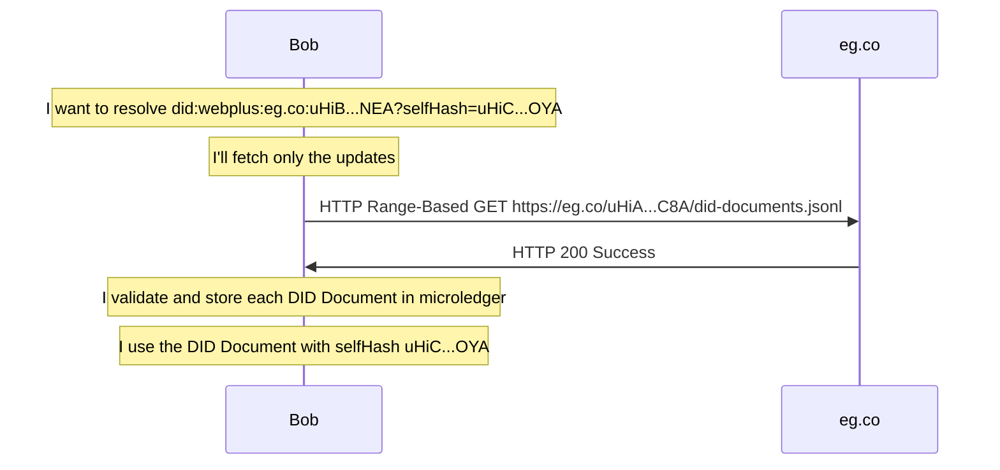

Bob resolves a specific DID document by `versionId`:

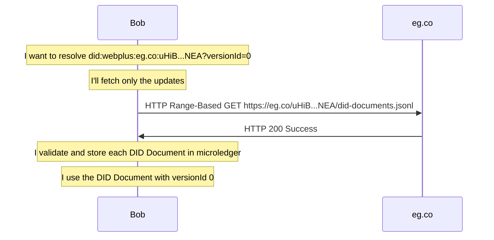

#### DID Update

Like DID creation, from the perspective of the VDR, DID update is simply a matter of verifying and storing a DID document `HTTP PUT`-ed to the [resolution URL for the DID](#did-to-url-mapping).  Because the new DID document is a non-root DID document, the verification includes verifying the relationship between the new DID document and the previous DID document, which MUST be present on the VDR and be valid.  In addition to the generic DID document verification, the VDR MUST validate that the DID's domain, optional port, and path are all consistent with the VDR's service domain, port, and path.

Alice updates her DID:

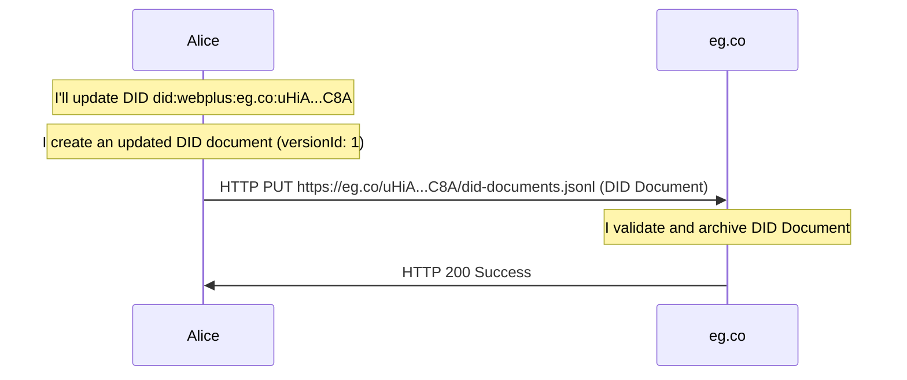

#### DID Deactivate

DID Deactivation is supported by updating the DID document to disallow updates, thereby preventing any future updates while having no possible verification relationships, effectively "tombstoning" the DID.  Thus no separate endpoint is needed for DID Deactivation.

#### DID Delete -- Explicitly Not Supported

See [DID Delete](#did-delete----explicitly-not-supported) for rationale.

### DID Resolver

A DID resolver is what translates a DID into a DID document through a "resolution" process.  Like `did:web`, this involves translating the DID into a specific [resolution URL](#did-to-url-mapping) that can be used to fetch the microledger of DID documents.  The domain component of the DID is what defines which VDR is responsible for hosting and serving the DID's DID documents.

Using a filesystem mapping instead of query parameters in the [resolution URL](#did-to-url-mapping) allows for static-content servers that don't support query parameters to act as VDRs, such as personal websites, company websites, or even [GitHub Pages](https://pages.github.com/).  This capability is important for decentralization and self-sovereignty.

There are two kinds of `did:webplus` DID resolver: "full" and "thin".  Each have different capabilities and intended uses.

#### Full DID Resolver

The "Full" DID Resolver keeps its own copy of the microledger for each DID it resolves.  This provides a few crucial capabilities:
-   It can detect DID forks and alterations.
-   It can perform historical DID resolution, thereby allowing verification of historical signed artifacts.
-   In many cases, DID resolution can happen entirely offline, providing very low latency.

The Full DID Resolver can also optionally use a trusted VDG to
-   take part in the "scope of agreement" for that VDG,
-   fetch DID documents from the VDG, including those whose VDRs are no longer online, and
-   fetch the latest DID document quickly, so that it can begin to verify signed artifacts in one thread while it fetches and verifies the rest of the DID document history in another thread.

Note that a Full DID Resolver that uses a VDG is still verifying every single DID document it fetches.

#### Thin DID Resolver

The "Thin" DID Resolver does not need to keep its own copy of the microledger for each DID it resolves.  Instead, it uses a trusted VDG to resolve a DID, thereby outsourcing the work of fetching, verifying, and archiving DID documents to the VDG.  It simply issues a resolution request to the VDG, and the VDG returns the appropriate, pre-verified DID document (noting that the VDG fetches, verifies, and archives any DID documents it doesn't yet have).

Advantages of the Thin DID Resolver:
-   DID Resolution is as simple as it is in `did:web` (i.e. a single HTTP GET to the VDG).
-   Constant-time DID resolution, if the resolved DID document is already present in the VDG (which will be the case for DIDs that push DID updates to the VDG).

Disadvantages of the Thin DID Resolver:
-   It requires trusting an external service (the VDG).
-   It requires a network connection to operate.

#### DID Resolver Operations

See the [DID Resolution Mechanics](#did-resolution-mechanics) section for the mechanics of DID resolution.

### Verifying Party

A Verifying Party can verify a digitally signed artifact by resolving the DID of the signer to obtain and use the appropriate public key for signature verification.

A Verifying Party will use a DID Resolver to resolve the DID.  They may use a [Full DID Resolver](#full-did-resolver) or a [Thin DID Resolver](#thin-did-resolver), depending on their needs.

### Verifiable Data Gateway

The Verifiable Data Gateway (VDG) is a large-scale web service that provides several crucial features of `did:webplus`, which are detailed in this section, but can be summarized as follows.
-   [What Does a VDG Do?](#what-does-a-vdg-do)
-   [A VDG provides a scope of agreement](#a-vdg-provides-a-scope-of-agreement) for clients of the VDG.
-   [A VDG allows for the existence of a "Thin" DID Resolver](#a-vdg-allows-for-a-thin-did-resolver).
-   [A VDG can pre-fetch+verify+archive DID documents](#pre-emptive-did-fetching-and-verification) upon VDR's DID update in some cases.
-   A VDG can service DID resolution requests in constant time, if the resolved DID document is already present in the VDG.
-   A VDG is web-cache-friendly, and can employ a CDN to:
    -   reduce load on the VDG service,
    -   provide additional security (e.g. mitigating DoS attacks), and
    -   provide extremely low-latency DID resolution via web caching at the edge.

First, some important concepts must be articulated.

#### Scope of Agreement for DID Documents

Each Full DID resolver has its own verified model of the world (meaning the full histories of all DIDs it has ever resolved).  If there's no need to interact with the world model of other Full DID resolvers (meaning the full histories of all DIDs the others have ever resolved), then there is no need for anything further, and the "most basic" architecture of `did:webplus` suffices.

A problem arises when the interaction expands to include multiple verifying parties for a given DID.  The obviously correct and desired scenario is one in which all verifying parties agree on the full history of the given DID.  If verifying parties disagree on any part of the history of any specific DID, they do not reside within a "scope of agreement".  This condition is known as a [DID fork](#did-fork) and, if detected, MUST be considered a kind of fraud and MUST result in the offending DID being considered invalid[^].

##### One-to-One Relationship

In ["most basic" `did:webplus` architecture](#most-basic-didwebplus-architecture), DID documents are authored by DID Controllers, DID documents are served by VDRs, and DID documents are fetched, verified, and archived by Full DID resolvers.

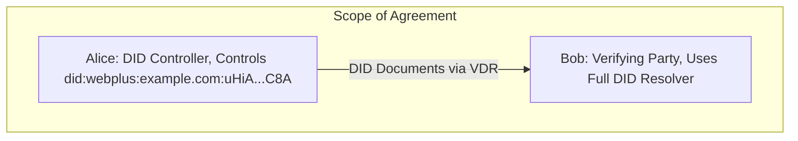

This describes a purely one-to-one relationship between Alice and Bob, who both reside within a "scope of agreement".  This scenario is already achieved by the "most basic" architecture.

##### DID Fork

A DID fork is where a malicious DID controller authors two (or more) differing yet valid histories, assigning one to each of the targeted verifying and with the collusion of the VDR (see Footnote 1), one history is served to each of the targeted verifying parties (see Footnote 2), all for the purpose of defrauding those verifying parties, for example signature repudiation, e.g. in a legal dispute.

In this scenario, each of the targeted verifying parties fetch, verify, and archive DID documents successfully, and from their solitary perspectives, everything appears valid, and they carry on with their normal business.  If the verifying parties "compared notes" (see Footnote 3), they would readily detect the DID fork, and SHOULD take action against the DID controller.

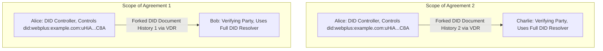

In order for the DID fork to originate from the same `did:webplus` DID, it must have the same root DID document (because this is what determines the root self-hash that comprises the suffix of the DID), and the differing histories are forked at a later version, as in the following diagram.  Note the differing `selfHash` field values in the forked DID documents of corresponding versions.

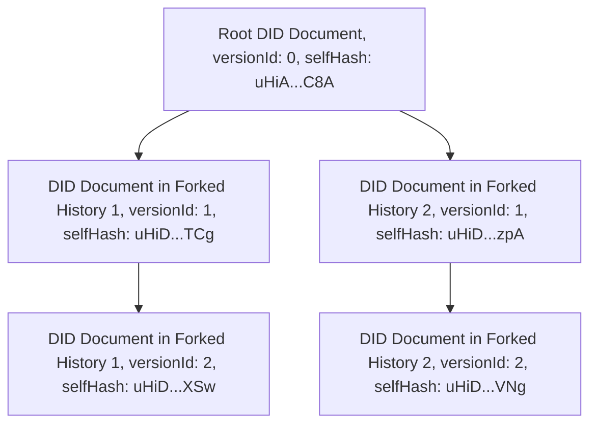

However, verifying parties aren't necessarily even aware of each other, let alone able to communicate with each other in order to ensure detection of DID forks.  While in principle a DID fork could be uncovered later during an audit or other legal process, the damage may have long since been done.

Thus detecting DID forks as early as possible is an important security mechanism for `did:webplus`.  This motivates, as will be described soon, the use of a VDG.

Footnotes:
1.  This is an achievable scenario given how easy it is to run one's own VDR.
2.  This would require detecting who is requesting DID documents, e.g. via IP address, and serving the DID document(s) from the assigned, forked history to them.
3.  The verifying parties could "compare notes" by comparing the `selfHash` fields from each DID document version they each hold.  If the `selfHash` fields differ, yet come from self-consistent histories, then those verifying parties have detected a DID fork.

##### DID Deletion/Alteration

Another category of fraud is the erasure or alteration of existing DID document(s).  Again, this would require a malicious DID controller to collude with a malicious VDR to delete or alter one or more DID documents to effectively erase or rewrite a portion of the DID's history.

This kind of fraud would be used in signature repudiation -- a DID controller legally disputing that they signed a particular artifact, perhaps because they want to get out of a contract with a counterparty to buy or sell something.

If the counterparty in this fraud scenario uses a Full DID resolver, then they have a copy of the verified DID history at the time of contract signing, and can use this in the legal dispute to prove that the DID controller did indeed produce the disputed signature.

However, if the verified history of the DID at the time of contracting signing is not available for the legal process, then the signature can be plausibly repudiated, because it can't be verifiably linked to the root DID document.  This motivates the use of a Full DID Resolver, and as will be described soon, the use of a VDG.

#### What Does a VDG Do?

The basic function of a Verifiable Data Gateway is in essence to be a Full DID Resolver that runs as a large-scale web service.  To reiterate what that means, the VDG fetches, verifies, archives, and resolves DID documents on behalf of its many users.  Because it archives previously fetched and verified DID documents, in many cases (e.g. resolving a DID document with a specific versionId or selfHash) it can resolve the DID in constant time.

DID resolution via VDG is illustrated in the following sequence diagram.  Bob is a Verifying Party who uses a VDG for DID resolution.  `eg.co` is a VDR hosted at that domain.  Bob wants to resolve the DID `did:webplus:eg.co:uHiA...C8A`, and say the most recent DID document on `eg.co` for that DID has `versionId: 1`.

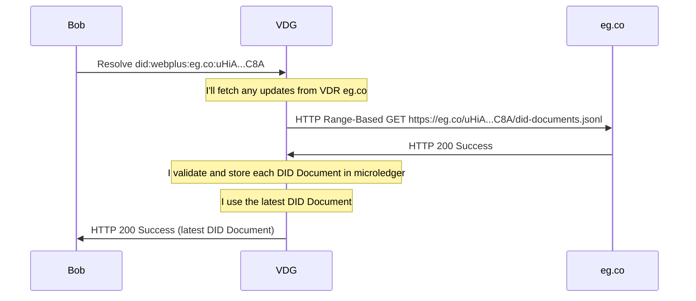

If Bob resolves the same DID before that DID has been updated, then the sequence diagram is the same, but the VDG's HTTP Range-Based GET to the VDR eg.co will return 0 bytes of updates, no verification needs to be done, and then the VDG will return the same DID document as in the previous example.

If Bob were to resolve a DID with specific query parameters, such as `versionId=1`, then the VDG could return it immediately (See [DID Resolution Options](#did-resolution-options) and [DID Resolution Metadata](#did-resolution-metadata)).

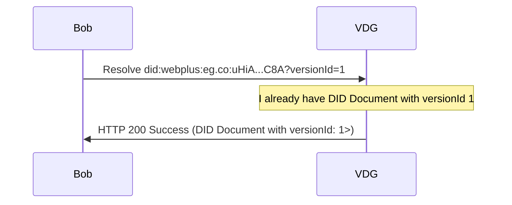

Say that Alice, who is the controller of `did:webplus:eg.co:uHiA...C8A`, updates the DID (see [VDR](#verifiable-data-registry)), and if the VDR is configured to do so, will notify the VDG that the DID has been updated.

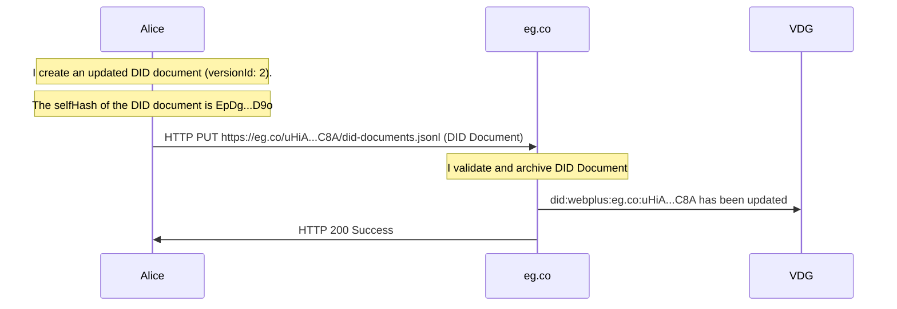

Now Bob resolves the DID again, without query parameters, in order to get the latest DID document.


The use of a VDG provides other important qualitative and quantitative features, which will now be described in detail.

#### A VDG Provides a Scope of Agreement

One of the primary purposes of a VDG is that it can provide a shared scope of agreement across multiple verifying parties.  Parties can choose to trust a particular VDG.  All parties that trust the same VDG will exist within the same scope of agreement, which is defined as the DID histories fetched, verified, archived, and resolved by that VDG.

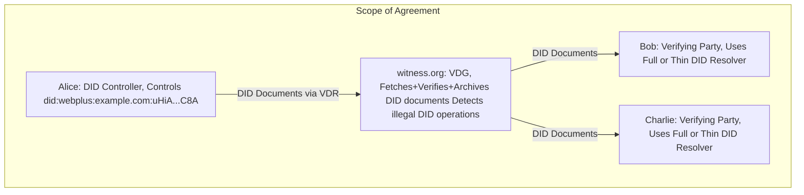

Note that there's nothing preventing multiple VDGs from operating over different sets of DIDs (overlapping or not).  Each of these VDGs defines its own scope of agreement, and these will only coincide if the VDGs operate on the same set of DIDs.

An example of two non-overlapping scopes of agreement corresponding to two VDGs:

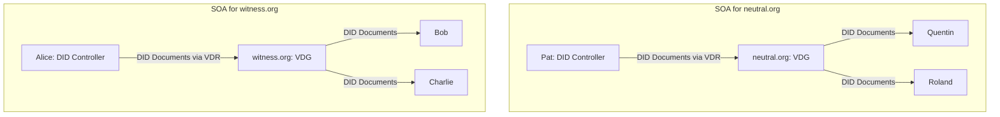

Another diagram could show a partial overlap between two scopes of agreement, and is left as an exercise for the reader.

#### A VDG Allows for a Thin DID Resolver

The presence of a VDG allows for the existence of the "Thin" DID resolver, which is configured to use a trusted VDG to perform fetching, verification, and archival on behalf of the Thin DID resolver.

The Thin DID resolver is equivalent in complexity to the `did:web` DID resolver -- it only must issue a HTTP GET operation to an appropriate URL in order to fetch the appropriate DID document.  However, DID document fetched from the trusted VDG has already been verified, so no further verification is needed on the part of the Thin DID resolver.  This makes the Thin DID resolver browser-friendly -- an important adoption criteria.

#### Pre-emptive DID Fetching and Verification

VDRs can be configured to pre-emptively push DID updates to specific VDGs.  This is illustrated in the following diagram.  Alice controls `did:webplus:eg.co:uHiA...C8A` and updates her DID (see [VDR](#verifiable-data-registry)).  Let's say that the VDG is running at `witness.org`.

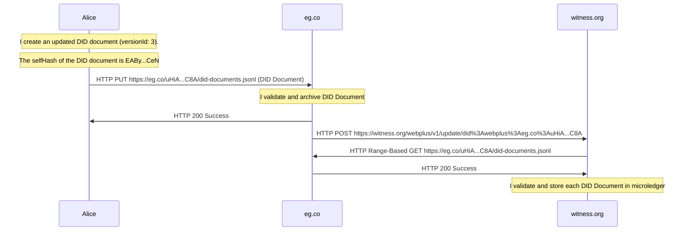

Now, if Bob resolves the DID, it can be returned in constant time.

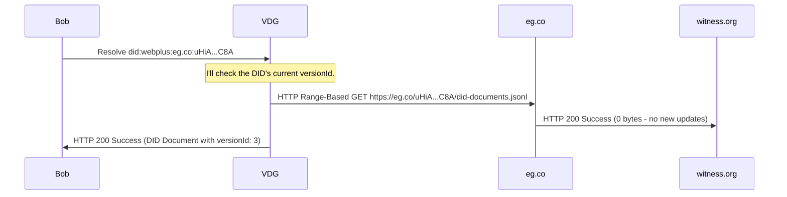

Better though, in practice, signatures should include the selfHash and versionId parameters in the key identifier field, which plays a twofold role:
-   It is a limited form of witnessing, wherein the signer is committing to a particular DID history in an artifact received by outside parties.
-   It makes the DID resolution specific and require fewer steps.
-   In the case where the Verifying Party is using a local Full DID resolver, any repeat DID resolutions can happen entirely offline, and therefore with very low latency!

[As shown previously](#what-does-a-vdg-do), if Bob were to resolve a DID with specific query parameters, such as `versionId=3`, then the VDG could return it immediately without needing to query the VDR for the current DID document.

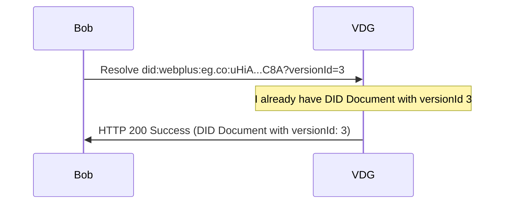

#### HTTP API for VDG

A VDG MUST offer the following HTTP API, logically grouped into sections:

[DID Microledger](#did-microledger) Fetch:
-   `GET /webplus/v1/fetch/{did}/did-documents.jsonl`: Fetch the `did-documents.jsonl` (i.e. microledger) file for a DID.  If the VDG does not have the microledger for the DID, then it will fetch it from the VDR and verify it before returning it, and will store it in its own DID document store.  This endpoint MUST support HTTP Range-Based GET requests so that Full DID Resolvers can fetch only the updates for a given DID relative to what they already have in their DID document store.

DID Resolution for use by the [Thin DID Resolver](#thin-did-resolver):
-   `GET /webplus/v1/resolve/{did}`: Resolve the latest DID document for a DID.
-   `GET /webplus/v1/resolve/{did}?{query}`: Resolve a specific DID document for a DID using query parameters.

Both of the `resolve` endpoints MUST accept HTTP headers indicating the desired [DID Resolution Options](#did-resolution-options), as follows:
-   `accept`: The media type of the desired representation of the DID document.  MAY be omitted.  Note that this parameter is ignored by `did:webplus`, as the DID Document has a canonical form and will always be returned in that form.
-   `X-DID-Request-Creation-Metadata`: If true, attempt to populate the "Creation" fields of the [DID Document Metadata](#did-document-metadata), subject to the value of the `X-DID-Local-Resolution-Only` header.  MAY be omitted.  If omitted, defaults to `false`.
-   `X-DID-Request-Next-Metadata`: If true, attempt to populate the "Next Update" fields of the [DID Document Metadata](#did-document-metadata), subject to the value of the `X-DID-Local-Resolution-Only` header.  MAY be omitted.  If omitted, defaults to `false`.
-   `X-DID-Request-Latest-Metadata`: If true, attempt to populate the "Latest Update" fields of the [DID Document Metadata](#did-document-metadata), subject to the value of the `X-DID-Local-Resolution-Only` header.  MAY be omitted.  If omitted, defaults to `false`.
-   `X-DID-Request-Deactivated-Metadata`: If true, attempt to populate the "Deactivated" field of the [DID Document Metadata](#did-document-metadata), subject to the value of the `X-DID-Local-Resolution-Only` header.  MAY be omitted.  If omitted, defaults to `false`.
-   `X-DID-Local-Resolution-Only`: If true, then DID resolution will be attempted purely from [locally-known data](#did-document-store); no network requests will be made in the process of resolving the DID document and DID document metadata.  Note that this means that some cases may not be resolvable, and in those situations, will return an error.  MAY be omitted.  If omitted, defaults to `false` (i.e. network requests will be allowed).

DID Update for [VDRs](#verifiable-data-registry) to notify of DID updates.
-   `POST /webplus/v1/update/{did}`: This is used by a VDR upon DID Update to notify VDG(s) that the specified DID has been updated, and that the VDG SHOULD pre-emptively fetch, verify, and store the updates.  There should be no body in this HTTP POST request.  This process serves two purposes:
    -   It allows the VDG to pre-emptively fetch, verify, and store the updates, so that when a DID resolution or did-documents.jsonl fetch request is made, the VDG can return the appropriate data immediately.  This is what allows the Thin DID Resolver to operate in constant time.
    -   It commits DIDs to their updates within the scope of agreement of the VDG, and any attempt to delete, alter, or fork a DID will be detected and rejected.

### DID Document Store

The unit of data in `did:webplus` is the DID Document, from which the rest of the data model is derived (e.g. DID document metadata, the microledger).  DID documents contain their own identifiers in the form of their `selfHash` field, and they link to their predecessors via the `prevDIDDocumentSelfHash` field.  The DID Document Store is what provides the basic logic behind the `did:webplus` data model -- verifying, archiving, and performing queries on `did:webplus` DID documents.

Many components of `did:webplus` use a DID document store in some form in order to function:
-   DID controller: Keeps its own copy of the controlled DID's microledger -- the entire history of DID documents.
-   VDR: Keeps a copy of the microledger for each DID it serves.
-   VDG: Keeps a copy of the microledger for each DID it witnesses and serves.
-   Full DID resolver: Keeps a local copy of the microledger for each DID it resolves, so that:
    -   It can keep its own copy of the microledger for historical DID document resolution and audit.
    -   It can service certain DID resolution requests fully offline.

Notably, the Thin DID resolver does not use a DID document store.  Instead, it outsources that functionality to the [Verifiable Data Gateway](#verifiable-data-gateway).

### Security and Privacy Considerations

Refer to the [`did:web` spec](https://w3c-ccg.github.io/did-method-web/#security-and-privacy-considerations) for general security and privacy considerations.  `did:webplus` adds additional considerations, which will be described here.

#### Authentication and Authorization for DID Operations

As in [`did:web`](https://w3c-ccg.github.io/did-method-web/#authentication-and-authorization), `did:webplus` does not specify any **authentication** requirements for [[ref: VDR]]s or [[ref: VDG]]s, leaving it up to specific implementations to provide appropriate authentication mechanisms.

Note however, that **authorization** for `did:webplus` DID operations is defined purely in terms of cryptographically verifiable relationships, and is specified in [this section](#did-document).

#### Personally-Identifying Information (PII) Considerations

Because `did:webplus` DIDs and DID documents are intended to be immutable, long-lived, and stored in many places, complete deletion of DIDs and DID documents is not feasible (and is not even defined by this specification).  Thus, users and systems must take measures to ensure that PII is not stored in DIDs and DID documents.

For example, a DID could be `did:webplus:bob.lablaugh.law:uHiA4kEWRG7tRs3ASyeX8eTHQ_JBuZW5rjn9Rb7MuYBDIBA`, which contains the name "Bob LaBlaugh", which is technically PII.  However, if the name is already in a domain name, then perhaps the person has already accepted the consequences of having publicized their name.

A more subtle example would be a DID like `did:webplus:example.com:bob.lablaugh:uHiA4kEWRG7tRs3ASyeX8eTHQ_JBuZW5rjn9Rb7MuYBDIBA`, say where the DID corresponds to the user account, and in this case of PII (the user's real name).  This would be a specific policy of the VDR that hosts the DID, and the VDR would need to gain the consent of the user regarding this potential publication of PII.

Other examples would be where the DID document contains PII, such as in a service endpoint, or in a "linked Verifiable Presentation".  In these cases, because the DID controller is responsible for the content of the DID document, the DID controller is responsible for ensuring that PII is not stored in the DID document, or accepting the consequences of having published it.

### Example: Creating and Updating a DID

This example can be run using the Rust implementation of `did:webplus`; see [example-creating-and-updating-a-did.md](https://github.com/LedgerDomain/did-webplus/blob/main/doc/example-creating-and-updating-a-did.md).

#### Creating a DID

For now, let's generate a single Ed25519 key to use in all the verification methods for the DID we will create.  In JWK format, the private key is:

```json
{
  "kty": "OKP",
  "crv": "Ed25519",
  "x": "lZq_V0eF2PaFk07maitC6e-cMcCkYxkX1ugKRzFgodQ",
  "d": "QnHzhmP0Koud9_KZmJPBgx3liXD7hszwTpUKkYOxTbA"
}
```

We'll also need a key that is authorized to update the DID document.  In publicKeyMultibase format, the public key is:

```
u7QFCWKaWNQ5FsNShO8BlZwjHa5xkGleeETKwu-vjf1SZXg
```

Creating a DID produces the root DID document (represented in 'pretty' JSON for readability; actual DID document is compact JSON):

```json
{
  "id": "did:webplus:example.com:hey:uHiCa77-pRHbSiSIPSFO_EOlpw100j30VQnhWCXuwVMSA-w",
  "selfHash": "uHiCa77-pRHbSiSIPSFO_EOlpw100j30VQnhWCXuwVMSA-w",
  "updateRules": {
    "key": "u7QFCWKaWNQ5FsNShO8BlZwjHa5xkGleeETKwu-vjf1SZXg"
  },
  "validFrom": "2025-11-19T01:21:47.699Z",
  "versionId": 0,
  "verificationMethod": [
    {
      "id": "did:webplus:example.com:hey:uHiCa77-pRHbSiSIPSFO_EOlpw100j30VQnhWCXuwVMSA-w?selfHash=uHiCa77-pRHbSiSIPSFO_EOlpw100j30VQnhWCXuwVMSA-w&versionId=0#0",
      "type": "JsonWebKey2020",
      "controller": "did:webplus:example.com:hey:uHiCa77-pRHbSiSIPSFO_EOlpw100j30VQnhWCXuwVMSA-w",
      "publicKeyJwk": {
        "kid": "did:webplus:example.com:hey:uHiCa77-pRHbSiSIPSFO_EOlpw100j30VQnhWCXuwVMSA-w?selfHash=uHiCa77-pRHbSiSIPSFO_EOlpw100j30VQnhWCXuwVMSA-w&versionId=0#0",
        "kty": "OKP",
        "crv": "Ed25519",
        "x": "lZq_V0eF2PaFk07maitC6e-cMcCkYxkX1ugKRzFgodQ"
      }
    }
  ],
  "authentication": [
    "#0"
  ],
  "assertionMethod": [
    "#0"
  ],
  "keyAgreement": [
    "#0"
  ],
  "capabilityInvocation": [
    "#0"
  ],
  "capabilityDelegation": [
    "#0"
  ]
}
```

Note that the `updateRules` field is what defines update authorization for this DID document.

The associated DID document metadata (at the time of DID creation) is:

```json
{
  "created": "2025-11-19T01:21:47Z",
  "createdMilliseconds": "2025-11-19T01:21:47.699Z",
  "updated": "2025-11-19T01:21:47Z",
  "updatedMilliseconds": "2025-11-19T01:21:47.699Z",
  "versionId": "0",
  "deactivated": false
}
```

We set the private JWK's `kid` field (key ID) to match that of its public JWK's `kid` field in the DID document (in particular, including the query params `selfHash` and `versionId`), so that signatures produced by this private JWK identify which DID document was current as of signing, as well as identify which specific key was used to produce the signature (the alternative would be to attempt to verify the signature against all applicable public keys listed in the DID document).  The private JWK is now:

```json
{
  "kid": "did:webplus:example.com:hey:uHiCa77-pRHbSiSIPSFO_EOlpw100j30VQnhWCXuwVMSA-w?selfHash=uHiCa77-pRHbSiSIPSFO_EOlpw100j30VQnhWCXuwVMSA-w&versionId=0#0",
  "kty": "OKP",
  "crv": "Ed25519",
  "x": "lZq_V0eF2PaFk07maitC6e-cMcCkYxkX1ugKRzFgodQ",
  "d": "QnHzhmP0Koud9_KZmJPBgx3liXD7hszwTpUKkYOxTbA"
}
```

#### Updating the DID

Let's generate another key to rotate in for some verification methods.  In JWK format, the new private key is:

```json
{
  "kty": "OKP",
  "crv": "Ed25519",
  "x": "g2AYHF11v8WZyWajLDVAhN5mfSrMaXFsKdApmLY6vBg",
  "d": "MpFvO25_pQbC3APLdNJi_-95mShEtaXG151Pardsy6s"
}
```

A new update key is also needed.  In publicKeyMultibase format, the new public key is:

```
u7QFNzTwiEH-gYlFQ_jb01lEFnWnyZPzq-rcehFEbF-rPFg
```

Updating a DID produces the next DID document (represented in 'pretty' JSON for readability; actual DID document is compact JSON):

```json
{
  "id": "did:webplus:example.com:hey:uHiCa77-pRHbSiSIPSFO_EOlpw100j30VQnhWCXuwVMSA-w",
  "selfHash": "uHiCB0zZPRtP5SRrRj-dHe8DxkVAhdUZqEaRZEJ7-rSaa5Q",
  "prevDIDDocumentSelfHash": "uHiCa77-pRHbSiSIPSFO_EOlpw100j30VQnhWCXuwVMSA-w",
  "updateRules": {
    "key": "u7QFNzTwiEH-gYlFQ_jb01lEFnWnyZPzq-rcehFEbF-rPFg"
  },
  "proofs": [
    "eyJhbGciOiJFZDI1NTE5Iiwia2lkIjoidTdRRkNXS2FXTlE1RnNOU2hPOEJsWndqSGE1eGtHbGVlRVRLd3UtdmpmMVNaWGciLCJjcml0IjpbImI2NCJdLCJiNjQiOmZhbHNlfQ..DlqKjcvzBqMk8fE0AMqOr1Lnj6NgiMTv6iZMFWxHHWYLRz2KFVs9uTCVUfRrEBS2FAqLWY2u2lve8TNopSUkBA"
  ],
  "validFrom": "2025-11-19T01:21:47.715Z",
  "versionId": 1,
  "verificationMethod": [
    {
      "id": "did:webplus:example.com:hey:uHiCa77-pRHbSiSIPSFO_EOlpw100j30VQnhWCXuwVMSA-w?selfHash=uHiCB0zZPRtP5SRrRj-dHe8DxkVAhdUZqEaRZEJ7-rSaa5Q&versionId=1#0",
      "type": "JsonWebKey2020",
      "controller": "did:webplus:example.com:hey:uHiCa77-pRHbSiSIPSFO_EOlpw100j30VQnhWCXuwVMSA-w",
      "publicKeyJwk": {
        "kid": "did:webplus:example.com:hey:uHiCa77-pRHbSiSIPSFO_EOlpw100j30VQnhWCXuwVMSA-w?selfHash=uHiCB0zZPRtP5SRrRj-dHe8DxkVAhdUZqEaRZEJ7-rSaa5Q&versionId=1#0",
        "kty": "OKP",
        "crv": "Ed25519",
        "x": "lZq_V0eF2PaFk07maitC6e-cMcCkYxkX1ugKRzFgodQ"
      }
    },
    {
      "id": "did:webplus:example.com:hey:uHiCa77-pRHbSiSIPSFO_EOlpw100j30VQnhWCXuwVMSA-w?selfHash=uHiCB0zZPRtP5SRrRj-dHe8DxkVAhdUZqEaRZEJ7-rSaa5Q&versionId=1#1",
      "type": "JsonWebKey2020",
      "controller": "did:webplus:example.com:hey:uHiCa77-pRHbSiSIPSFO_EOlpw100j30VQnhWCXuwVMSA-w",
      "publicKeyJwk": {
        "kid": "did:webplus:example.com:hey:uHiCa77-pRHbSiSIPSFO_EOlpw100j30VQnhWCXuwVMSA-w?selfHash=uHiCB0zZPRtP5SRrRj-dHe8DxkVAhdUZqEaRZEJ7-rSaa5Q&versionId=1#1",
        "kty": "OKP",
        "crv": "Ed25519",
        "x": "g2AYHF11v8WZyWajLDVAhN5mfSrMaXFsKdApmLY6vBg"
      }
    }
  ],
  "authentication": [
    "#0",
    "#1"
  ],
  "assertionMethod": [
    "#0"
  ],
  "keyAgreement": [
    "#0"
  ],
  "capabilityInvocation": [
    "#1"
  ],
  "capabilityDelegation": [
    "#0"
  ]
}
```

Note that the `proofs` field contains signatures (in JWS format) that are to be validated and used with the `updateRules` field of the previous DID document to verify update authorization.  Note that the JWS proof has a detached payload, and decodes as:

```json
{
  "header": {
    "alg": "Ed25519",
    "b64": false,
    "crit": [
      "b64"
    ],
    "kid": "u7QFCWKaWNQ5FsNShO8BlZwjHa5xkGleeETKwu-vjf1SZXg"
  },
  "payload": null,
  "signature": "DlqKjcvzBqMk8fE0AMqOr1Lnj6NgiMTv6iZMFWxHHWYLRz2KFVs9uTCVUfRrEBS2FAqLWY2u2lve8TNopSUkBA"
}
```

The associated DID document metadata (at the time of DID update) is:

```json
{
  "created": "2025-11-19T01:21:47Z",
  "createdMilliseconds": "2025-11-19T01:21:47.699Z",
  "updated": "2025-11-19T01:21:47Z",
  "updatedMilliseconds": "2025-11-19T01:21:47.715Z",
  "versionId": "1",
  "deactivated": false
}
```

However, the DID document metadata associated with the root DID document has now become:

```json
{
  "created": "2025-11-19T01:21:47Z",
  "createdMilliseconds": "2025-11-19T01:21:47.699Z",
  "nextUpdate": "2025-11-19T01:21:47Z",
  "nextUpdateMilliseconds": "2025-11-19T01:21:47.715Z",
  "nextVersionId": "1",
  "updated": "2025-11-19T01:21:47Z",
  "updatedMilliseconds": "2025-11-19T01:21:47.715Z",
  "versionId": "1",
  "deactivated": false
}
```

We set/update the `kid` field of each private JWK to match that of the public JWK in the updated DID document:

```json
{
  "kid": "did:webplus:example.com:hey:uHiCa77-pRHbSiSIPSFO_EOlpw100j30VQnhWCXuwVMSA-w?selfHash=uHiCB0zZPRtP5SRrRj-dHe8DxkVAhdUZqEaRZEJ7-rSaa5Q&versionId=1#0",
  "kty": "OKP",
  "crv": "Ed25519",
  "x": "lZq_V0eF2PaFk07maitC6e-cMcCkYxkX1ugKRzFgodQ",
  "d": "QnHzhmP0Koud9_KZmJPBgx3liXD7hszwTpUKkYOxTbA"
}
```

```json
{
  "kid": "did:webplus:example.com:hey:uHiCa77-pRHbSiSIPSFO_EOlpw100j30VQnhWCXuwVMSA-w?selfHash=uHiCB0zZPRtP5SRrRj-dHe8DxkVAhdUZqEaRZEJ7-rSaa5Q&versionId=1#1",
  "kty": "OKP",
  "crv": "Ed25519",
  "x": "g2AYHF11v8WZyWajLDVAhN5mfSrMaXFsKdApmLY6vBg",
  "d": "MpFvO25_pQbC3APLdNJi_-95mShEtaXG151Pardsy6s"
}
```

#### Updating the DID Again

Let's generate a third key to rotate in for some verification methods.  In JWK format, the new private key is:

```json
{
  "kty": "OKP",
  "crv": "Ed25519",
  "x": "yInsmsZAFa3-z16fj_jADU0jq22XIGLiJOKBWOL-9sw",
  "d": "ylSTkp5eckhJeGIdSijSjLP73PyP-LtQIugGbem9puQ"
}
```

Updated DID document (represented in 'pretty' JSON for readability; actual DID document is compact JSON):

```json
{
  "id": "did:webplus:example.com:hey:uHiCa77-pRHbSiSIPSFO_EOlpw100j30VQnhWCXuwVMSA-w",
  "selfHash": "uHiBUjvHda3aTQVUPwTEvXqxOumNSd_aua0dTrjEBpZSelg",
  "prevDIDDocumentSelfHash": "uHiCB0zZPRtP5SRrRj-dHe8DxkVAhdUZqEaRZEJ7-rSaa5Q",
  "updateRules": {
    "key": "u7QHRFrSIiqny7_FrLze0VF1xXgjHp0_5fzhlB2bfwLOYag"
  },
  "proofs": [
    "eyJhbGciOiJFZDI1NTE5Iiwia2lkIjoidTdRRk56VHdpRUgtZ1lsRlFfamIwMWxFRm5XbnlaUHpxLXJjZWhGRWJGLXJQRmciLCJjcml0IjpbImI2NCJdLCJiNjQiOmZhbHNlfQ..SjRoWc9NlZrjqHu_eECRaqk57VVVeenk6YQgo7FYtBrO66O9_YOdKYJAo2dHOhSLDpht92YmUfC0HsWMrOH1BQ"
  ],
  "validFrom": "2025-11-19T01:21:47.766Z",
  "versionId": 2,
  "verificationMethod": [
    {
      "id": "did:webplus:example.com:hey:uHiCa77-pRHbSiSIPSFO_EOlpw100j30VQnhWCXuwVMSA-w?selfHash=uHiBUjvHda3aTQVUPwTEvXqxOumNSd_aua0dTrjEBpZSelg&versionId=2#2",
      "type": "JsonWebKey2020",
      "controller": "did:webplus:example.com:hey:uHiCa77-pRHbSiSIPSFO_EOlpw100j30VQnhWCXuwVMSA-w",
      "publicKeyJwk": {
        "kid": "did:webplus:example.com:hey:uHiCa77-pRHbSiSIPSFO_EOlpw100j30VQnhWCXuwVMSA-w?selfHash=uHiBUjvHda3aTQVUPwTEvXqxOumNSd_aua0dTrjEBpZSelg&versionId=2#2",
        "kty": "OKP",
        "crv": "Ed25519",
        "x": "yInsmsZAFa3-z16fj_jADU0jq22XIGLiJOKBWOL-9sw"
      }
    },
    {
      "id": "did:webplus:example.com:hey:uHiCa77-pRHbSiSIPSFO_EOlpw100j30VQnhWCXuwVMSA-w?selfHash=uHiBUjvHda3aTQVUPwTEvXqxOumNSd_aua0dTrjEBpZSelg&versionId=2#0",
      "type": "JsonWebKey2020",
      "controller": "did:webplus:example.com:hey:uHiCa77-pRHbSiSIPSFO_EOlpw100j30VQnhWCXuwVMSA-w",
      "publicKeyJwk": {
        "kid": "did:webplus:example.com:hey:uHiCa77-pRHbSiSIPSFO_EOlpw100j30VQnhWCXuwVMSA-w?selfHash=uHiBUjvHda3aTQVUPwTEvXqxOumNSd_aua0dTrjEBpZSelg&versionId=2#0",
        "kty": "OKP",
        "crv": "Ed25519",
        "x": "lZq_V0eF2PaFk07maitC6e-cMcCkYxkX1ugKRzFgodQ"
      }
    },
    {
      "id": "did:webplus:example.com:hey:uHiCa77-pRHbSiSIPSFO_EOlpw100j30VQnhWCXuwVMSA-w?selfHash=uHiBUjvHda3aTQVUPwTEvXqxOumNSd_aua0dTrjEBpZSelg&versionId=2#1",
      "type": "JsonWebKey2020",
      "controller": "did:webplus:example.com:hey:uHiCa77-pRHbSiSIPSFO_EOlpw100j30VQnhWCXuwVMSA-w",
      "publicKeyJwk": {
        "kid": "did:webplus:example.com:hey:uHiCa77-pRHbSiSIPSFO_EOlpw100j30VQnhWCXuwVMSA-w?selfHash=uHiBUjvHda3aTQVUPwTEvXqxOumNSd_aua0dTrjEBpZSelg&versionId=2#1",
        "kty": "OKP",
        "crv": "Ed25519",
        "x": "g2AYHF11v8WZyWajLDVAhN5mfSrMaXFsKdApmLY6vBg"
      }
    }
  ],
  "authentication": [
    "#0",
    "#1"
  ],
  "assertionMethod": [
    "#0"
  ],
  "keyAgreement": [
    "#2"
  ],
  "capabilityInvocation": [
    "#2"
  ],
  "capabilityDelegation": [
    "#0"
  ]
}
```

Note that the `proofs` field contains signatures (in JWS format) that are to be validated and used with the `updateRules` field of the previous DID document to verify update authorization.  Note that the JWS proof has a detached payload, and decodes as:

```json
{
  "header": {
    "alg": "Ed25519",
    "b64": false,
    "crit": [
      "b64"
    ],
    "kid": "u7QFNzTwiEH-gYlFQ_jb01lEFnWnyZPzq-rcehFEbF-rPFg"
  },
  "payload": null,
  "signature": "SjRoWc9NlZrjqHu_eECRaqk57VVVeenk6YQgo7FYtBrO66O9_YOdKYJAo2dHOhSLDpht92YmUfC0HsWMrOH1BQ"
}
```

The associated DID document metadata (at the time of DID update) is:

```json
{
  "created": "2025-11-19T01:21:47Z",
  "createdMilliseconds": "2025-11-19T01:21:47.699Z",
  "updated": "2025-11-19T01:21:47Z",
  "updatedMilliseconds": "2025-11-19T01:21:47.766Z",
  "versionId": "2",
  "deactivated": false
}
```

Similarly, the DID document metadata associated with the previous DID document has now become:

```json
{
  "created": "2025-11-19T01:21:47Z",
  "createdMilliseconds": "2025-11-19T01:21:47.699Z",
  "nextUpdate": "2025-11-19T01:21:47Z",
  "nextUpdateMilliseconds": "2025-11-19T01:21:47.766Z",
  "nextVersionId": "2",
  "updated": "2025-11-19T01:21:47Z",
  "updatedMilliseconds": "2025-11-19T01:21:47.766Z",
  "versionId": "2",
  "deactivated": false
}
```

However, the DID document metadata associated with the root DID document has now become:

```json
{
  "created": "2025-11-19T01:21:47Z",
  "createdMilliseconds": "2025-11-19T01:21:47.699Z",
  "nextUpdate": "2025-11-19T01:21:47Z",
  "nextUpdateMilliseconds": "2025-11-19T01:21:47.715Z",
  "nextVersionId": "1",
  "updated": "2025-11-19T01:21:47Z",
  "updatedMilliseconds": "2025-11-19T01:21:47.766Z",
  "versionId": "2",
  "deactivated": false
}
```

We set/update the `kid` field of each private JWK to match that of the public JWK in the updated DID document:

```json
{
  "kid": "did:webplus:example.com:hey:uHiCa77-pRHbSiSIPSFO_EOlpw100j30VQnhWCXuwVMSA-w?selfHash=uHiBUjvHda3aTQVUPwTEvXqxOumNSd_aua0dTrjEBpZSelg&versionId=2#0",
  "kty": "OKP",
  "crv": "Ed25519",
  "x": "lZq_V0eF2PaFk07maitC6e-cMcCkYxkX1ugKRzFgodQ",
  "d": "QnHzhmP0Koud9_KZmJPBgx3liXD7hszwTpUKkYOxTbA"
}
```

```json
{
  "kid": "did:webplus:example.com:hey:uHiCa77-pRHbSiSIPSFO_EOlpw100j30VQnhWCXuwVMSA-w?selfHash=uHiBUjvHda3aTQVUPwTEvXqxOumNSd_aua0dTrjEBpZSelg&versionId=2#1",
  "kty": "OKP",
  "crv": "Ed25519",
  "x": "g2AYHF11v8WZyWajLDVAhN5mfSrMaXFsKdApmLY6vBg",
  "d": "MpFvO25_pQbC3APLdNJi_-95mShEtaXG151Pardsy6s"
}
```

```json
{
  "kid": "did:webplus:example.com:hey:uHiCa77-pRHbSiSIPSFO_EOlpw100j30VQnhWCXuwVMSA-w?selfHash=uHiBUjvHda3aTQVUPwTEvXqxOumNSd_aua0dTrjEBpZSelg&versionId=2#2",
  "kty": "OKP",
  "crv": "Ed25519",
  "x": "yInsmsZAFa3-z16fj_jADU0jq22XIGLiJOKBWOL-9sw",
  "d": "ylSTkp5eckhJeGIdSijSjLP73PyP-LtQIugGbem9puQ"
}
```

## Appendices

### `did:webplus` Data Model

Recall that a DID is an identifier that, through the DID resolution process, can be used to obtain the DID controller's public keys.  This is the primary mechanism by which a Verifying Party can verify signatures on artifacts signed by the DID controller.

The indirection of using a DID instead of the public keys directly is that it makes key rotation possible without breaking existing verification relationships (e.g. credentials issued by or to a DID).  

Besides the DID itself, the primary piece of data is the DID document.  A DID document is a JSON object that contains the public keys of the DID controller (and can potentially include other things).  The current DID document can be updated over time, and a central feature of `did:webplus` is that the entire, versioned history of DID documents is available and can be cryptographically verified.

#### DID Microledger

The cryptographically verifiable history of a DID is called its "microledger".  The microledger is a sequence of DID documents, each of which is linked to the previous in a cryptographically verifiable way.  The first DID document has no predecessor, and is called the "root" DID document.

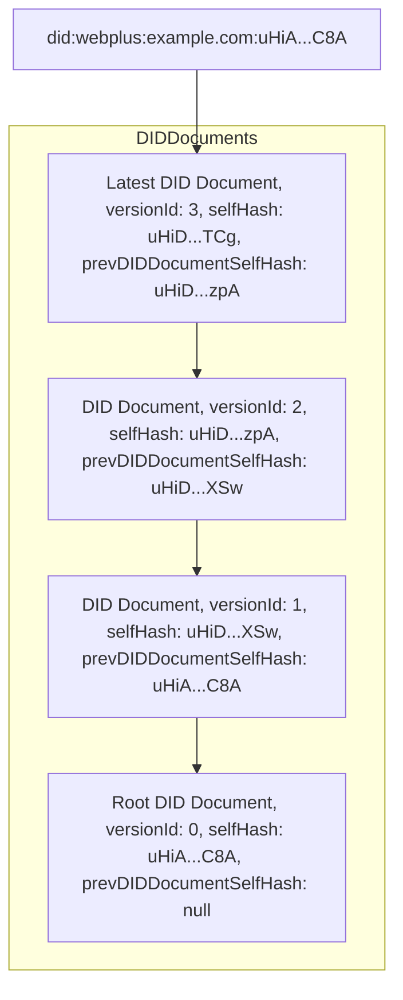

#### DID Document

In `did:webplus`, the DID document MUST be represented as the [JSON Canonicalization Scheme (JCS)](https://www.rfc-editor.org/rfc/rfc8785) representation of a JSON object that conforms to the following data model.  It is meant to conform to the [DID spec](https://www.w3.org/TR/did-1.0/).  In addition, it has several fields that are specific to `did:webplus`.

##### DID Document Data Model

-   `id`: MUST be a valid `did:webplus` DID with no query parameters or fragment.
-   `selfHash`: MUST be a valid self-hash in [MBHash](#mbhash-values) format.  See [Self-Hashed Data](#self-hashed-data) for specifics on the self-hash generation and verification process.
-   `prevDIDDocumentSelfHash`: MUST be `null` or a valid self-hash in [MBHash](#mbhash-values) format.
-   `updateRules`: MUST be a valid [UpdateRules](#update-rules).
-   `proofs`: MUST be `null` or an array of JWS proofs as described in [Self-Hashed Signed Data](#self-hashed-signed-data).
-   `validFrom`: MUST be a valid [RFC 3339](https://www.rfc-editor.org/rfc/rfc3339) timestamp having precision no greater than milliseconds (in order to achieve interoperability with Javascript implementations).
-   `versionId`: MUST be an unsigned integer.
-   `verificationMethod`: If present, MUST be an array of [verification methods](https://www.w3.org/TR/did-1.0/#verification-methods).
-   Fields for [Verification Relationships](https://www.w3.org/TR/did-1.0/#verification-relationships), if present, MUST be:
    -   [`authentication`](https://www.w3.org/TR/did-1.0/#authentication)
    -   [`assertionMethod`](https://www.w3.org/TR/did-1.0/#assertion)
    -   [`keyAgreement`](https://www.w3.org/TR/did-1.0/#key-agreement)
    -   [`capabilityInvocation`](https://www.w3.org/TR/did-1.0/#capability-invocation)
    -   [`capabilityDelegation`](https://www.w3.org/TR/did-1.0/#capability-delegation)

There are additional constraints that depend on if a DID document is a root DID document or a non-root DID document.

##### Root DID Document

A root DID document is the first DID document in a DID's microledger.  It has the following additional constraints:
-   `prevDIDDocumentSelfHash` MUST be `null`.
-   `versionId` MUST be 0.

##### Non-Root DID Documents

A non-root DID document is any DID document that is not a root DID document.  It has the following additional constraints:
-   `prevDIDDocumentSelfHash` MUST be the `selfHash` of the previous DID document.
-   `updateRules` MAY differ from the `updateRules` of the previous DID document (and in some cases, e.g. when any pre-rotation keys have been used in proofs, it is RECOMMENDED to differ in order to rotate those keys).
-   `validFrom` MUST be strictly later than the `validFrom` of the previous DID document.
-   `versionId` MUST be exactly one greater than the `versionId` of the previous DID document.

##### Example DID Documents

Here is an example of the DID documents in the microledger for a DID.

Root DID document (`versionId` 0):

```json
{
  "id": "did:webplus:example.com:uHiAgZ9Z9FJ38ZGeQRZoFxxXfbpvRsg2DuPXJ5vzR1Uy3HQ",
  "selfHash": "uHiAgZ9Z9FJ38ZGeQRZoFxxXfbpvRsg2DuPXJ5vzR1Uy3HQ",
  "updateRules": {
    "hashedKey": "uHiCMmFumKCTx6yxWPtoRM_VZj4DvdcHs2KEBK941pr8SXQ"
  },
  "validFrom": "2025-11-19T01:43:26.979Z",
  "versionId": 0,
  "verificationMethod": [
    {
      "id": "did:webplus:example.com:uHiAgZ9Z9FJ38ZGeQRZoFxxXfbpvRsg2DuPXJ5vzR1Uy3HQ?selfHash=uHiAgZ9Z9FJ38ZGeQRZoFxxXfbpvRsg2DuPXJ5vzR1Uy3HQ&versionId=0#0",
      "type": "JsonWebKey2020",
      "controller": "did:webplus:example.com:uHiAgZ9Z9FJ38ZGeQRZoFxxXfbpvRsg2DuPXJ5vzR1Uy3HQ",
      "publicKeyJwk": {
        "kid": "did:webplus:example.com:uHiAgZ9Z9FJ38ZGeQRZoFxxXfbpvRsg2DuPXJ5vzR1Uy3HQ?selfHash=uHiAgZ9Z9FJ38ZGeQRZoFxxXfbpvRsg2DuPXJ5vzR1Uy3HQ&versionId=0#0",
        "kty": "OKP",
        "crv": "Ed25519",
        "x": "iR2bJQmYXszbiuW1yfeRmLtBkGsEczp99ZfEuQSPxwM"
      }
    }
  ],
  "authentication": [
    "#0"
  ],
  "assertionMethod": [
    "#0"
  ],
  "keyAgreement": [
    "#0"
  ],
  "capabilityInvocation": [
    "#0"
  ],
  "capabilityDelegation": [
    "#0"
  ]
}
```

Note that the `proofs` field is omitted since no proofs are required for the root DID document.  However, they MAY be present.

Next DID Document (`versionId` 1), in particular having new `updateRules`:

```json
{
  "id": "did:webplus:example.com:uHiAgZ9Z9FJ38ZGeQRZoFxxXfbpvRsg2DuPXJ5vzR1Uy3HQ",
  "selfHash": "uHiCH05FmexvfpT8lxesItafqipzHvm_npUt4PRRCc8scEw",
  "prevDIDDocumentSelfHash": "uHiAgZ9Z9FJ38ZGeQRZoFxxXfbpvRsg2DuPXJ5vzR1Uy3HQ",
  "updateRules": {
    "key": "u7QF0zsY-DxwlvuzDsosc0ZgD5drHhvNHXVkxwDDCMZHSIQ"
  },
  "proofs": [
    "eyJhbGciOiJFZDI1NTE5Iiwia2lkIjoidTdRRzJPMlZtMjJlMWc0djZWUnhqWTlRZ205WHFKQUtmX2IzY0g2T2M0UjBiaHciLCJjcml0IjpbImI2NCJdLCJiNjQiOmZhbHNlfQ..gjcKygeSmc9XC8h6Eosu1zPkjVF9_vPTI5Dm0PbNT7UZU4GvfvN1NsVEBWcXTEcCL22CW1ID5rb3SmjtsJnxBg"
  ],
  "validFrom": "2025-11-19T01:43:26.992Z",
  "versionId": 1,
  "verificationMethod": [
    {
      "id": "did:webplus:example.com:uHiAgZ9Z9FJ38ZGeQRZoFxxXfbpvRsg2DuPXJ5vzR1Uy3HQ?selfHash=uHiCH05FmexvfpT8lxesItafqipzHvm_npUt4PRRCc8scEw&versionId=1#0",
      "type": "JsonWebKey2020",
      "controller": "did:webplus:example.com:uHiAgZ9Z9FJ38ZGeQRZoFxxXfbpvRsg2DuPXJ5vzR1Uy3HQ",
      "publicKeyJwk": {
        "kid": "did:webplus:example.com:uHiAgZ9Z9FJ38ZGeQRZoFxxXfbpvRsg2DuPXJ5vzR1Uy3HQ?selfHash=uHiCH05FmexvfpT8lxesItafqipzHvm_npUt4PRRCc8scEw&versionId=1#0",
        "kty": "OKP",
        "crv": "Ed25519",
        "x": "I87S--BfzauBtdJ4FkYLj9-bOF8gwj6iOMIx_lE-vhM"
      }
    },
    {
      "id": "did:webplus:example.com:uHiAgZ9Z9FJ38ZGeQRZoFxxXfbpvRsg2DuPXJ5vzR1Uy3HQ?selfHash=uHiCH05FmexvfpT8lxesItafqipzHvm_npUt4PRRCc8scEw&versionId=1#1",
      "type": "JsonWebKey2020",
      "controller": "did:webplus:example.com:uHiAgZ9Z9FJ38ZGeQRZoFxxXfbpvRsg2DuPXJ5vzR1Uy3HQ",
      "publicKeyJwk": {
        "kid": "did:webplus:example.com:uHiAgZ9Z9FJ38ZGeQRZoFxxXfbpvRsg2DuPXJ5vzR1Uy3HQ?selfHash=uHiCH05FmexvfpT8lxesItafqipzHvm_npUt4PRRCc8scEw&versionId=1#1",
        "kty": "OKP",
        "crv": "Ed25519",
        "x": "iR2bJQmYXszbiuW1yfeRmLtBkGsEczp99ZfEuQSPxwM"
      }
    }
  ],
  "authentication": [
    "#0"
  ],
  "assertionMethod": [
    "#1"
  ],
  "keyAgreement": [
    "#1"
  ],
  "capabilityInvocation": [
    "#0"
  ],
  "capabilityDelegation": [
    "#1"
  ]
}
```

Note that the element in the `proofs` field is a JWS whose header decodes as:

```json
{
  "alg": "Ed25519",
  "kid": "u7QG2O2Vm22e1g4v6VRxjY9Qgm9XqJAKf_b3cH6Oc4R0bhw",
  "crit": [
    "b64"
  ],
  "b64": false
}
```

Note that the hash of the `kid` field of the JWS header is `uHiCMmFumKCTx6yxWPtoRM_VZj4DvdcHs2KEBK941pr8SXQ` which should match the `hashedKey` field of the previous DID Document's `updateRules`.

Next DID Document (`versionId` 2), which shows how to deactivate a DID by setting `updateRules` to `{}`:

```json
{
  "id": "did:webplus:example.com:uHiAgZ9Z9FJ38ZGeQRZoFxxXfbpvRsg2DuPXJ5vzR1Uy3HQ",
  "selfHash": "uHiCrJkmyeDz01JHbmu-ft17Gwx11Les974G0BIV9fGWoDQ",
  "prevDIDDocumentSelfHash": "uHiCH05FmexvfpT8lxesItafqipzHvm_npUt4PRRCc8scEw",
  "updateRules": {},
  "proofs": [
    "eyJhbGciOiJFZDI1NTE5Iiwia2lkIjoidTdRRjB6c1ktRHh3bHZ1ekRzb3NjMFpnRDVkckhodk5IWFZreHdERENNWkhTSVEiLCJjcml0IjpbImI2NCJdLCJiNjQiOmZhbHNlfQ..qBBCb1-4OHtnfyV_0KrUBpDE0aXhjBkYmCT5h7A0vtYtCGBVhfjUIRCrj3rJeO5h3N627uSdFcj2308Iaf6fAA"
  ],
  "validFrom": "2025-11-19T01:43:27.032Z",
  "versionId": 2,
  "verificationMethod": [],
  "authentication": [],
  "assertionMethod": [],
  "keyAgreement": [],
  "capabilityInvocation": [],
  "capabilityDelegation": []
}
```

Removing all verification methods from a deactivated DID is RECOMMENDED so that no unrevocable keys are left in the DID document, but is not required.  Note that the element in the `proofs` field is a JWS whose header decodes as:

```json
{
  "alg": "Ed25519",
  "kid": "u7QF0zsY-DxwlvuzDsosc0ZgD5drHhvNHXVkxwDDCMZHSIQ",
  "crit": [
    "b64"
  ],
  "b64": false
}
```

Note that the `kid` field of the JWS header matches the `key` field of the previous DID Document's `updateRules`.

##### Addressability of DID Documents

A crucial feature of `did:webplus` is that each DID document in a DID's entire history can be addressed by its `selfHash` or `versionId`.  This allows the DID resolution process to resolve a specific DID document.

-   When a DID controller signs an artifact, it SHOULD specify the signing key in "fully qualified" form, meaning that it includes, in the query parameters of the signature's key id, the `selfHash` and `versionId` of the DID document current at time of signing.  Using the DID documents in the [the previous example](#example-did-documents):
    -   If the root DID document (i.e. that with `versionId` 0) is current at time of signing, and the key being used is `#0`, then the key id of the signature is:

        ```
        did:webplus:example.com:uHiBbwc0wsYWMlHZMw0FWia3tmMMaVqIGBME0MTzcbMn6gA?selfHash=uHiBbwc0wsYWMlHZMw0FWia3tmMMaVqIGBME0MTzcbMn6gA&versionId=0#0
        ```

    -   If the DID document with `versionId` 1 is current at time of signing, and the key being used is `#0`, then the key id of the signature is:

        ```
        did:webplus:example.com:uHiBbwc0wsYWMlHZMw0FWia3tmMMaVqIGBME0MTzcbMn6gA?selfHash=uHiBel_fCXh6jHWrnLRL0TjR3VpgeEGh_ZAALu91bknParA&versionId=1#0
        ```

-   When a Verifying Party verifies a signature that includes the fully-qualified key id, it can resolve the addressed DID document directly.  In the case where the addressed DID document already exists in the Verifying Party's Full DID resolver's archive, then this DID resolution can happen fully offline, and therefore will be very fast.  If the addressed DID document does not exist in the Verifying Party's archive, then the Verifying Party MUST fetch the addressed DID document, as well as any unfetched DID updates, from the VDR.

#### Validation of DID Documents

The validation of DID documents is critical to the security of `did:webplus`.  While a VDR is the origin for a DID's DID documents (by serving the `did-documents.jsonl` file), the validation of the DID documents is defined purely based on its data model, and therefore can be performed by any party.

While the entire microledger for the DID is served by the VDR as a single `did-documents.jsonl` file (a newline-delimited concatenation of JCS-serialized DID documents), each DID document is the logical unit of validation.  However, the validity of a DID document depends on the validity of its predecessor, and by transitivity, its entire history.

DID documents MUST be validated upon receipt into any system.  If a DID document is invalid, it MUST be rejected and an error MUST be returned.

The following specifies the validation process for a DID document.  All validations MUST succeed in order for a DID document to be considered valid.  The validation process differs slightly depending on if the DID document being validated is a root DID document or a non-root DID document.

1.  Verify that the DID document is exactly equal to its JCS-serialized form.
1.  Verify that the DID document deserializes into a JSON object that conforms to [the DID document data model](#did-document-data-model).  Extra fields not specified in the data model are allowed.  The following rules will refer to fields in the DID document.
1.  Verify that the `validFrom` field has precision no greater than milliseconds.
1.  Verify that the `validFrom` field is not before the UNIX epoch (i.e. `1970-01-01T00:00:00.000Z`).
1.  For each verification method in the `verificationMethod` field, its `id` field MUST be a fully-qualified DID resource URL (for example, from [this](#addressability-of-did-documents), `did:webplus:example.com:uHiBbwc0wsYWMlHZMw0FWia3tmMMaVqIGBME0MTzcbMn6gA?selfHash=uHiBel_fCXh6jHWrnLRL0TjR3VpgeEGh_ZAALu91bknParA&versionId=1#0`), meaning that:
    1.  It MUST have both the `selfHash` and `versionId` query parameters specified, in that specific order (needed in order to have a canonical representation).
    1.  Its `selfHash` query parameter value MUST be equal to the `selfHash` field of the DID document.
    1.  Its `versionId` query parameter value MUST be equal to the `versionId` field of the DID document.
    1.  It MUST have a URL fragment.  The fragment specifies the identifier for the verification method within the DID document, and can be used (as a relative URL) in the verification relationship fields (e.g. `authentication`, `assertionMethod`, etc.).
1.  Verify that the DID document is validly [self-hashed signed data](#self-hashed-signed-data).  If ANY of the proofs are invalid, the DID document MUST be rejected as invalid.  The self-hash slots for the DID document depend on if this is a root DID document or a non-root DID document.
    1.  If this is a root DID document:
        1.  The self-hash slots are:
            1.  The last path element of the DID in the `id` field (e.g. the `uHiBAgZTMYe29bhacxcReklhgbWzSbVTd5c-jL62nfES-4Q` substring at the end of `did:webplus:example.com:uHiBAgZTMYe29bhacxcReklhgbWzSbVTd5c-jL62nfES-4Q`)
            1.  The `selfHash` field.
            1.  For each verification method in the `verificationMethod` field, the following slots:
                1.  The last path element of the `id` field (i.e. the `uHiBAgZTMYe29bhacxcReklhgbWzSbVTd5c-jL62nfES-4Q` substring before the `?` in `did:webplus:example.com:uHiBAgZTMYe29bhacxcReklhgbWzSbVTd5c-jL62nfES-4Q?selfHash=uHiBAgZTMYe29bhacxcReklhgbWzSbVTd5c-jL62nfES-4Q&versionId=0#0`).
                1.  The value of the `selfHash` query parameter (i.e. the `uHiBAgZTMYe29bhacxcReklhgbWzSbVTd5c-jL62nfES-4Q` substring after `?selfHash=` and before `&`).  *Also note* that the `versionId` query parameter must be present in the `id` field, and must be equal to the `versionId` field of the DID document (which in the case of the root DID document is `0`).
                1.  If the controller of this verification method is this DID document's DID itself, then:
                    1.  The last path element of the DID in the `controller` field.
    1.  If this is a non-root DID document:
        1.  The self-hash slots are:
            1.  The `selfHash` field.
            1.  For each verification method in the `verificationMethod` field, the following slots:
                1.  The value of the `selfHash` query parameter.  *Also note* that the `versionId` query parameter must be present in the `id` field, and must be equal to the `versionId` field of the DID document.
1.  Determine if this is a root DID document or a non-root DID document; if there is a `prevDIDDocumentSelfHash` field, then this is a non-root DID document, otherwise it is a root DID document.  If this is a non-root DID document, then recursively validate the predecessor DID document.
    1.  If this is a root DID document:
        1.  Verify that `versionId` is 0 (a numeric value, not a string).
    1.  If this is a non-root DID document:
        1.  Verify that the `id` field is identical to the `id` field of the predecessor DID document.
        1.  Verify that the `prevDIDDocumentSelfHash` field is identical to the `selfHash` field of the predecessor DID document.  This ensures that all checks are done regardless of if the predecessor DID document was retrieved by `selfHash` or `versionId`.
        1.  Verify that the `validFrom` field is strictly later than the `validFrom` field of the predecessor DID document.
        1.  Verify that `versionId` is a numeric value exactly equal to 1 plus the `versionId` of the predecessor DID document.
        1.  Verify that the proofs satisfy the `updateRules` of the predecessor DID document.

Note that extraneous proofs -- not directly used in the `updateRules` validation -- are allowed and are simply ignored for the purposes of DID document validation.  They can be used for other purposes beyond the scope of this specification.

#### DID Document Metadata

DID Document Metadata is a JSON object, conforming to the [DID spec](https://www.w3.org/TR/did-1.0/#did-document-metadata), that contains the following fields.  For purposes of `did:webplus` resolution mechanics, they are logically grouped into the following sections:

Creation Metadata
-   `created`: DID document metadata SHOULD include a `created` property to indicate the timestamp of the Create operation. The value of the property MUST be a string formatted as an XML Datetime normalized to UTC 00:00:00 and without sub-second decimal precision. For example: 2020-12-20T19:17:47Z.
-   `createdMilliseconds`: `did:webplus`-specific extension which represents the `created` timestamp with milliseconds precision.  This field is present so that it can be used in relation with the `validFrom` field of the DID document (using only the `created` field would give inaccurate results due to lack of precision).

Next Update Metadata
-   `nextUpdate`: DID document metadata MAY include a `nextUpdate` property if the resolved document version is not the latest version of the document. It indicates the timestamp of the next Update operation. The value of the property MUST follow the same formatting rules as the `created` property.
-   `nextUpdateMilliseconds`: `did:webplus`-specific extension which represents the `nextUpdate` timestamp with milliseconds precision.  This field is present so that it can be used in relation with the `validFrom` field of the DID document (using only the `nextUpdate` field would give inaccurate results due to lack of precision).
-   `nextVersionId`: DID document metadata MAY include a `nextVersionId` property if the resolved document version is not the latest version of the document. It indicates the version of the next Update operation. The value of the property MUST be an ASCII string.

Latest Update Metadata
-   `updated`: DID document metadata SHOULD include an `updated` property to indicate the timestamp of the last Update operation for the document version which was resolved. The value of the property MUST follow the same formatting rules as the `created` property. The `updated` property is omitted if an Update operation has never been performed on the DID document. If an `updated` property exists, it can be the same value as the `created` property when the difference between the two timestamps is less than one second.
-   `updatedMilliseconds`: `did:webplus`-specific extension which represents the `updated` timestamp with milliseconds precision.  This field is present so that it can be used in relation with the `validFrom` field of the DID document (using only the `updated` field would give inaccurate results due to lack of precision).
-   `versionId`: DID document metadata SHOULD include a versionId property to indicate the version of the last Update operation for the document version which was resolved. The value of the property MUST be an ASCII string.

Deactivated Metadata
-   `deactivated`: If a DID has been deactivated, DID document metadata MUST include this property with the boolean value true. If a DID has not been deactivated, this property is OPTIONAL, but if included, MUST have the boolean value `false`.

#### DID Resolution Options

Producing the various fields of the DID Document Metadata each require additional queries of local and/or non-local data.  These extra queries are wasted if this metadata is not needed.  Thus, the DID Resolution Options provide fields to specify which fields of the DID Document Metadata are desired.

For each field of the DID Document Metadata, there are conditions under which it can be produced purely from [locally-known data](#did-document-store), and an implementation SHOULD attempt to use only locally-known data whenever possible.  These conditions will not be specified in this document.

[DID Resolution Options](https://www.w3.org/TR/did-1.0/#did-resolution-options) is a JSON object that contains the following fields.
-   `accept`: This parameter is ignored by `did:webplus`, as the DID Document has a canonical form and will always be returned in that form.

`did:webplus`-specific fields:
-   `requestCreate`: If true, attempt to populate the "Creation" fields of the [DID Document Metadata](#did-document-metadata), subject to the `localResolutionOnly` flag.  If omitted, defaults to `false`.
-   `requestNext`: If true, attempt to populate the "Next Update" fields of the [DID Document Metadata](#did-document-metadata), subject to the `localResolutionOnly` flag.  If omitted, defaults to `false`.
-   `requestLatest`: If true, attempt to populate the "Latest Update" fields of the [DID Document Metadata](#did-document-metadata), subject to the `localResolutionOnly` flag.  If omitted, defaults to `false`.
-   `requestDeactivated`: If true, attempt to populate the "Deactivated" field of the [DID Document Metadata](#did-document-metadata), subject to the `localResolutionOnly` flag.  If omitted, defaults to `false`.
-   `localResolutionOnly`: If true, then DID resolution will be attempted purely from locally-known data; no network requests will be made in the process of resolving the DID document and DID document metadata.  Note that this means that some cases may not be resolvable, and in those situations, will return an error.  If omitted, defaults to `false` (i.e. network requests will be allowed).

#### DID Resolution Metadata

DID Resolution Metadata is a JSON object, conforming to the [DID spec](https://www.w3.org/TR/did-1.0/#did-resolution-metadata), that contains the following fields.
-   `contentType`: The Media Type of the returned didDocumentStream. This property is REQUIRED if resolution is successful and if the resolveRepresentation function was called. This property MUST NOT be present if the resolve function was called. The value of this property MUST be an ASCII string that is the Media Type of the conformant representations. The caller of the resolveRepresentation function MUST use this value when determining how to parse and process the didDocumentStream returned by this function into the data model.
-   `error`: The error code from the resolution process. This property is REQUIRED when there is an error in the resolution process. The value of this property MUST be a single keyword ASCII string. The possible property values of this field SHOULD be registered in the [DID Specification Registries](https://www.w3.org/TR/did-spec-registries/).

`did:webplus`-specific fields:
-   `fetchedUpdatesFromVDR`: This will be `true` if the resolution process involved attempting to fetch updates from the VDR for the DID, even if there were no new updates returned by the VDR.  Otherwise `false`.
-   `didDocumentResolvedLocally`: This will be `true` if the resolved DID document was already present in [locally-known data](#did-document-store).  Otherwise `false`.  Note that this and `fetchedUpdatesFromVDR` can be true simultaneously if metadata was requested that required fetching updates from VDR.
-   `didDocumentMetadataResolvedLocally`: This will be `true` if the DID Document Metadata was able to be produced purely from locally-known data.  Otherwise `false`.

#### Summary

-   A DID's entire history is represented by its microledger -- the ordered sequence of its DID documents.
-   Each DID document contains proofs that are required to satisfy the update rules of the previous DID document.  The root DID document isn't required to have proofs, but it MAY have proofs.
-   Each DID document is [self-hashed](#self-hashed-data), meaning:
    -   It contains its own identifier (the self-hash value).
    -   The self-hash value is a cryptographically verifiable commitment to the content of the DID document.
-   The DID itself contains the self-hash of its root DID document, and is therefore cryptographically committed to the content of its root DID document.
-   Each non-root DID document links to its predecessor via the predecessor's self-hash.  This relationship is what defines the microledger.  Each non-root DID document is cryptographically committed to the content of its predecessor, and therefore of all predecessors, transitively.
-   Each DID document has a `validFrom` timestamp, each successor DID document has a `validFrom` timestamp that is later than the `validFrom` timestamp of the predecessor DID document.  This provides a well-defined validity duration for each DID document.
-   Each DID document has a `versionId` field, which is an unsigned integer.  Each successor DID document has a `versionId` field that is exactly one greater than the `versionId` field of the predecessor DID document, starting with 0 for the root DID document.  This provides a well-defined numbering of DID documents.

### `did:webplus` Architecture

In `did:webplus`, the basic scheme of `did:web` is extended using specific mechanisms that provide various qualitative and security advantages, detailed in [the `did:webplus` data model](#didwebplus-data-model).  The most salient extension provided by `did:webplus` is that of cryptographic verifiability of a DID's entire history of DID documents.  This means that in `did:webplus`, a Verifying Party doesn't have to trust the VDR to faithfully represent the DID documents -- the Verifying Party can verify the DID documents directly.

`did:webplus` has several levels of architecture that are suitable for different use cases.  Generally, the more locally-scoped the use case, the simpler the architecture.

#### Background: `did:web` Architecture

The most rudimentary function of a DID is as follows.  Alice holds some private keys.  Bob wants to verify an artifact that Alice has signed with one of her private keys.  In order to verify Alice's signature, Bob needs the appropriate public key.  A DID is a mechanism by which Bob can retrieve Alice's public keys.

It will be useful to first describe the architecture for [`did:web`](https://w3c-ccg.github.io/did-method-web/), so that the specific extensions that `did:webplus` provides will be clear.  In this diagram, Alice is the DID Controller and Bob is the Verifying Party.

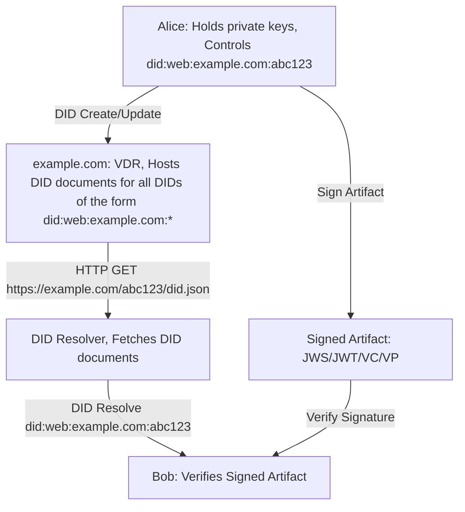

VDR stands for Verifiable Data Registry, and is a web service which serves the DID documents for DIDs associated with its domain (in this case, `example.com`).  While a DID's controller (Alice) is the author of the DID document for that DID, the VDR is the origin for retrieving the DID document.

It is easy to host one's own `did:web` VDR, since all it requires is the ability to serve static content at specific URLs.  Thus there will be many VDRs of varying sizes -- from personal web servers each hosting a single DID to massive web services that each host millions of DIDs (e.g. equivalent in scale to a large consumer web service).

In `did:web`, DID resolution (the operation performed by a Verifying Party to obtain the DID document for a given DID) is defined to be an HTTP GET on a URL that is derived from the DID.  In this case,

    did:web:example.com:abc123 -> https://example.com/abc123/did.json

Other examples:

    did:web:did.fancy.net:id:xyz456 -> https://did.fancy.net/id/xyz456/did.json
    did:web:splunge.co -> https://splunge.co/.well-known/did.json

Note the use of the `.well-known` directory corresponding to a "root level" DID.

In `did:web`, there is no verification of the DID document.  The method simply defines the VDR as the source of truth -- trusting that the VDR is accurately and faithfully representing the DID document.  Because the DID resolution process involves an HTTP GET using an `https` URL, the security of `did:web` depends on the security of the DNS system and the integrity of the TLS certificate chain from the root certificate authority to the VDR.

#### Most Basic `did:webplus` Architecture

The most basic architecture for `did:webplus` is given by the following diagram, and is directly analogous to the diagram for `did:web` given above.  Alice is the DID Controller and Bob is the Verifying Party.

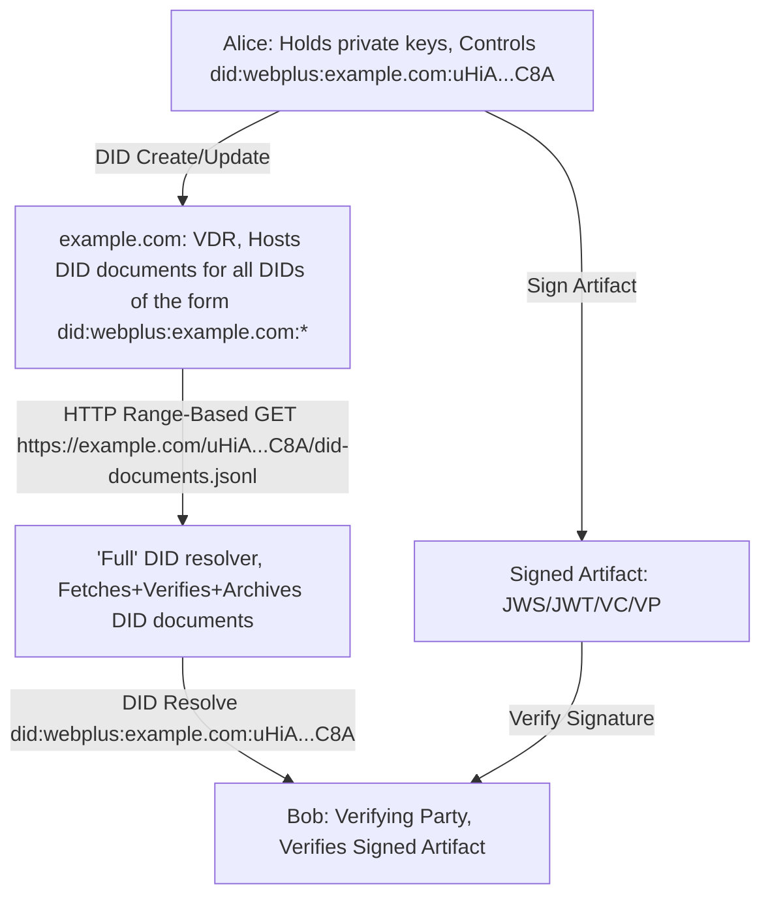

Note that the DID in the above diagram has been abbreviated so it will fit neatly.  The DID actually has the form:

    did:webplus:example.com:uHiBAgZTMYe29bhacxcReklhgbWzSbVTd5c-jL62nfES-4Q

and during DID resolution would translate to URL

    https://example.com/uHiBAgZTMYe29bhacxcReklhgbWzSbVTd5c-jL62nfES-4Q/did-documents.jsonl

In this scenario, the Verifying Party (Bob) runs a "Full" DID Resolver that handles all the fetching, verifying, and archival of DID documents, according to the `did:webplus` data model.  Resolving the same DID document can happen offline because it is already present in the archive.  DID updates are processed incrementally by the full DID resolver.

The VDR in `did:webplus` is performing the same function as that in `did:web`.  It SHOULD verify all DID documents posted to it by DID controllers.  However, even if the VDR doesn't perform its own verification and it serves an invalid DID document to the Full DID resolver, the Full DID resolver will detect the invalidity of the fetched DID document and return an appropriate error.

This "most basic" form of architecture is appropriate to use in scenarios such as:
-   Intra-organization operations in which organization participants can rely on the VDR remaining in service.
-   Use cases where it's not necessary to depend on long-term archival of DID documents by a third party that is neutral with respect to the VDR.
-   Use cases that will not involve legal disputes over signed artifacts.

Scenarios not handled by the "most basic" form of architecture can be handled by one of the following, higher forms of architecture.

#### Intermediate `did:webplus` Architecture

The intermediate architecture for `did:webplus` adds a Verifiable Data Gateway (VDG) service, which allows for the existence of a "Thin" DID resolver.  This architecture is given by the following diagram.

```mermaid
graph
    Alice[ Alice: Holds private keys, Controls did:webplus:example.com:uHiA...C8A ] -->|DID Create/Update| VDR
    Alice -->|Sign Artifact| Signature
    VDR[ example.com: VDR, Hosts DID documents for all DIDs of the form did:webplus:example.com:* ] -->| HTTP Range-Based GET https://example.com/uHiA...C8A/did-documents.jsonl | VDG
    VDG[ witness.org: VDG, Fetches+Verifies+Archives DID documents ] -->| HTTP GET https://witness.org/webplus/v1/resolve/did%3Awebplus%3Aexample.com%3AuHiA...C8A | Resolver
    Resolver[ 'Thin' DID resolver, Fetches pre-verified DID documents ] -->| DID Resolve did:webplus:example.com:uHiA...C8A | Bob
    Signature[ Signed Artifact: JWS/JWT/VC/VP ] -->|Verify Signature| Bob
    Bob[ Bob: Verifying Party, Verifies Signed Artifact ]
```

A VDG is a web service that provides several crucial features of `did:webplus`, described in detail in the [Verifiable Data Gateway](#verifiable-data-gateway) section.

Note that use of a VDG doesn't prevent use of a Full DID resolver.  The Full DID resolver can be configured to fetch DID documents from a VDG.  This fact is also described in detail in the [Verifiable Data Gateway](#verifiable-data-gateway) section.

The intermediate architecture is appropriate to use in scenarios such as:
-   Within a consortium of organizations who will share a VDG to provide witnessing and archival services.
-   Use cases where historical DID resolution is needed for audit purposes.
-   Some use cases that may involve legal disputes over signed artifacts.

#### Advanced `did:webplus` Architecture

The advanced architecture for `did:webplus` uses a cluster of VDGs (instead of a single one) and adds a Content Delivery Network (CDN), enabling a hyper-scaled VDG service delivering with lower latency.  This architecture is given by the following diagram.

```mermaid
graph
    Alice[ Alice: Holds private keys, Controls did:webplus:example.com:uHiA...C8A ] -->|DID Create/Update| VDR
    Alice -->|Sign Artifact| Signature
    VDR[ example.com: VDR, Hosts DID documents for all DIDs of the form did:webplus:example.com:* ] -->| HTTP Range-Based GET https://example.com/uHiA...C8A/did-documents.jsonl | VDGs
    VDGs[ VDG Cluster, Fetches+Verifies+Archives DID documents, Runs a consensus algorithm to agree on DID updates ] --> CDN
    CDN[ CDN: Caches DID documents at the edge ] -->| HTTP GET https://witness.org/witness/v1/resolve/did%3Awebplus%3Aexample.com%3AuHiA...C8A | Resolver
    Resolver[ 'Thin' DID resolver, Fetches pre-verified DID documents ] -->| DID Resolve did:webplus:example.com:uHiA...C8A | Bob
    Signature[ Signed Artifact: JWS/JWT/VC/VP ] -->|Verify Signature| Bob
    Bob[ Bob: Verifying Party, Verifies Signed Artifact ]
```

Currently, the details of how the VDG cluster nodes interact is unspecified, and is a matter of future work.

### Self-Hashed Data

#### Context

A cryptographic hash function computes a fixed-size "digest" of its input data that can be used as a powerful mechanism for distinguishing differing data.  The hash value of a piece of data is often used as a means for "content integrity protection" -- if even one bit of the input data is altered, the hash value will be different, and thus alterations in the input data are readily detectable.

Conventional content integrity protection operates by reporting the hash of a specific piece data in a side-channel, and then verifying that the computed hash of the data matches the reported hash value.  If these values don't match, then the data has been altered.  If these values match then practically speaking the data has not been altered (strictly speaking, hash collisions do exist but they are practically infeasible to compute).  In the case of a hash value mismatch, the alteration could have legitimate origins (a file was corrupted due to system fault), or could have malicious origins (an attacker trying to infiltrate data into a target system).

```mermaid
graph TD
    S[Source Data] -->|Compute Hash| H
    S --> O
    H[Hash of Data] --> O
    O[Source Data, Hash of Data]
```

In the conventional approach, the hash value of the data must be communicated in a side-channel, because any attempt to include the hash into the data will alter the data and thus change its hash value.

#### What Is Self-Hashed Data?

Self-hashed data is data which, under a specific definition, contains its own hash.  For the reason [described earlier](#context) this hash value can't be the conventional hash value.  However, by altering the hash generation and verification process, a kind of self-hash can be defined.

##### Self-Hash Slots

Self-hashable data must have slightly more structure than the untyped byte stream that is consumed by conventional hash functions.  In particular, self-hashable data must have a set of "self-hash slots" each of which are meant to be populated with the computed self-hash for the data.  What the self-hash slots are depends on semantic aspects of the data (i.e. which fields are considered to be self-hash slots).

Each self-hash slot is a tuple (B, H, V), where
-   B represents the base being used to encode the multikey; `base64url` is RECOMMENDED, but `base58btc` is also supported.
-   H represents the hash function being used and
-   V represents a value of the type output by H

##### Placeholders

Additionally, for each base B and hash function H, there is a "placeholder" (B, H, P), where P is the "all zeros" value of the type output by H.

##### Encoding Used in `did:webplus`

In `did:webplus`, hashes are represented as [MBHash](#mbhash-values) values, which are multibase-encoded multikeys.  See [MBHash Placeholder Values](#mbhash-placeholder-values) for the specific placeholder values for each base and hash function.

##### Self-Hashed Data Generation

At a high level, the process is:

```mermaid
graph TD
    S[Source Data] -->|Set Self-Hash Slots to Placeholder Value| P
    S --> O
    P[Data With Placeholders] -->|Canonicalize| C
    C[Canonicalized Data With Placeholders] -->|Compute Hash Conventionally| H
    H[Hash of: Canonicalized Data With Placeholders] --> O
    O{Set All Self-Hash Slots to Computed Hash} --> F
    F[Self-Hashed Data]
```

##### Self-Hashed Data Verification

At a high level, the process is:

```mermaid
graph TD
    S[Unverified Self-Hashed Data] -->|Check Equality of All Self-Hash Slots| Check1
    Check1[Are All Self-Hash Slots Equal?] -->|Yes| X
    Check1 -->|No| Failure[Verification Failed]
    X[ ] -->|Set Self-Hash Slots to Placeholder Value| P
    S --> O
    P[Data With Placeholders] -->|Canonicalize| C
    C[Canonicalized Data With Placeholders] -->|Compute Hash Conventionally| H
    H[Hash of: Canonicalized Data With Placeholders] --> O
    O{Are All Self-Hash Slots Equal to Computed Hash?}
    O -->|Yes| Success[Verification Succeeded]
    O -->|No| Failure[Verification Failed]
```

#### Concrete Example

For this example, let's use JSON as the data format, JSON Canonicalization Scheme (JCS), and `MBHash`es with `base64url` encoding and the Blake3 hash function, for which the placeholder value is `uHiAAAAAAAAAAAAAAAAAAAAAAAAAAAAAAAAAAAAAAAAAAAA` (abbreviated below as `uHiA...AAA`).  Define the data to have two self-hash slots:
-   the entire `selfHash` field and
-   the path component of the URL in the `$id` field.

Note that in this specific case, a self-hash slot is only a portion of a given JSON object field.  This specific pattern is used when generating the DID in `did:webplus`.

```mermaid
graph TD
    S["{
        #quot;foo#quot;:#quot;bar#quot;,
        #quot;data#quot;:123,
        #quot;selfHash#quot;:#quot;#quot;,
    }"] -->|Set Self-Hash Slots to Placeholder Value| P
    S --> O
    P["{
        #quot;foo#quot;:#quot;bar#quot;,
        #quot;data#quot;:123,
        #quot;selfHash#quot;:#quot;uHiA...AAA#quot;,
    }"] -->|Canonicalize using JCS| C
    C["{#quot;data#quot;:123,#quot;foo#quot;:#quot;bar#quot;,#quot;selfHash#quot;:#quot;uHiA...AAA#quot;}"] -->|Compute Hash Conventionally| H
    H[uHiA...C8A] --> O
    O{Set All Self-Hash Slots to Computed Hash} --> F
    F["{#quot;data#quot;:123,#quot;foo#quot;:#quot;bar#quot;,#quot;selfHash#quot;:#quot;uHiDfUtIoKo1-UHtk...cEQ#quot;}"]
```

The full self-hashed data, in JCS format, is:

    {"data":123,"foo":"bar","selfHash":"uHiDfUtIoKo1-UHtk5rvZhVUWMMNGa_dTD5AmjqXhwIocEQ"}

#### Implementations

-   Rust: [selfhash](https://github.com/LedgerDomain/selfhash) crate.

#### Attributions

-   The author of this document first learned of the concept behind self-hashing from [KERI](https://keri.one/) through its "self-addressing identifiers".

### Self-Hashed Signed Data

#### Signing Process

It's useful to include proofs within self-hashed data, e.g. JWS with a detached payload, where the payload is the data with its self-hash slots set to the placeholder values.

In the case of DID Documents, each proof is generated in the following way:
-   The DID Document's `proofs` field is deleted.
-   The DID Document's self-hash slots are set to the placeholder value for the chosen base and hash function.
-   The JCS-encoding of this modified DID Document is the signing input for the proof.  Call this `S`.
-   The DID Document is signed using the chosen signature algorithm and key.  In particular, the proof must be a detached JWS with a payload that is `S`.  Its JWS header MUST be `{"alg":"<signature-algorithm>","kid":"<MBPubKey>","crit":["b64"],"b64":false}`, where the `<MBPubKey>` is the [MBPubKey](#mbpubkey-values) representation of the public key corresponding to the signing key.

As many proofs as is needed are generated in this way.  Because of the process defined above, each proof has the same detached payload.  Once all proofs are obtained, they should be added to the `proofs` field of the DID Document, and then the DID Document must be self-hashed.  This commits the self-hashed DID Document to its contents, which includes the proofs.

#### Verifying Process

The process for verifying a proof is analogous to the signing process.
-   The signing input `S` is formed as in the signing process.
-   The `kid` field is extracted from the proof's JWS header.  This is the [MBPubKey](#mbpubkey-values) representation of the public key that will be used to verify the proof.
-   The signature is verified using the signature algorithm defined by the JWS header's `alg` field and the public key defined by the `kid` field.  The proof is valid if and only if the signature is valid.

#### MBHash Values

A MBHash value is a multibase-encoded multihash.

Details and Rust implementation: https://github.com/LedgerDomain/mbx?tab=readme-ov-file#mbhash-and-mbhashstr

The hash functions that MUST be supported by implementations of `did:webplus` are:
-   Blake3 -- RECOMMENDED

The following hash functions MAY be supported by implementations of `did:webplus`:
-   SHA2-256
-   SHA2-512

The bases that MUST be supported by implementations of `did:webplus` are:
-   `base64url` -- RECOMMENDED
-   `base58btc`

##### MBHash Placeholder Values

The placeholder values for the supported base and hash function are:
-   Blake3
    -   `base64url`: `uHiAAAAAAAAAAAAAAAAAAAAAAAAAAAAAAAAAAAAAAAAAAAA`
    -   `base58btc`: `zgVwffGvQHPgyjKpyzNtG58yEmCBbhSByS8omLpnxE9eqCT`
-   SHA2-256
    -   `base64url`: `uEiAAAAAAAAAAAAAAAAAAAAAAAAAAAAAAAAAAAAAAAAAAAA`
    -   `base58btc`: `zQmNLei78zWmzUdbeRB3CiUfAizWUrbeeZh5K1rhAQKCh51`
-   SHA2-512
    -   `base64url`: `uE0AAAAAAAAAAAAAAAAAAAAAAAAAAAAAAAAAAAAAAAAAAAAAAAAAAAAAAAAAAAAAAAAAAAAAAAAAAAAAAAAAAAAAA`
    -   `base58btc`: `z8VsnXyGnRwJpnrQXB8KcLstvgFYGZ2f5BCm3DVndcNZ8NswtkCqsut69e7yd1FKNtettjgy669GNVt8VSTGxkAiJaB`

#### MBPubKey Values

A MBPubKey value is a multibase-encoded multikey.

Details and Rust implementation: https://github.com/LedgerDomain/mbx?tab=readme-ov-file#mbpubkey-and-mbpubkeystr

In particular, a `base58btc`-encoded MBPubKey is identical to the method-specific identifier for `did:key` for that public key.

The bases that MUST be supported by implementations of `did:webplus` are:
-   `base64url` -- RECOMMENDED
-   `base58btc` -- allowed for compatibility with `did:key`, but is slower and slightly less space-efficient
